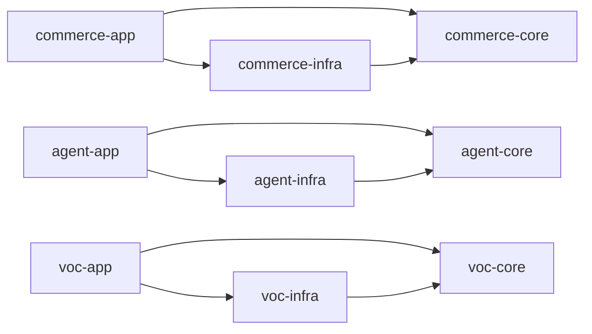
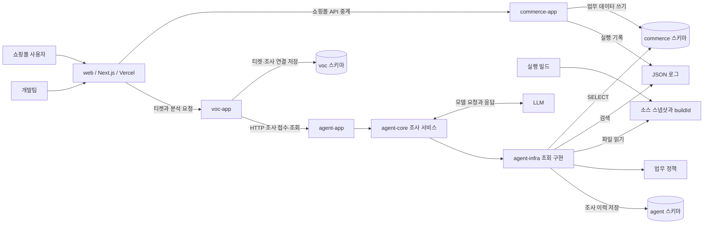

# 이커머스 VOC 조사 에이전트 — 멀티모듈 구조 제안

## 1. 설계 기준

이 문서는 3명이 Java·Spring Boot로 이틀 동안 구현할 구조 제안이다. 현재 저장소에는 설계 문서가 있으며, 아래 디렉터리와 빌드 설정은 구현 대상이다.

- 하나의 저장소에 백엔드 Gradle 모듈 10개와 프론트 프로젝트 `web`을 둔다. 백엔드 빌드 스크립트는 Groovy DSL을 기본안으로 한다.
- 상시 실행하는 Spring Boot 애플리케이션은 `commerce-app`, `agent-app`, `voc-app` 세 개다. A는 AI, B는 커머스, C는 VOC 티켓과 AI 연동을 담당한다. [3인 협업 가이드](collaboration.md)
- `web`은 Next.js·React·TypeScript를 사용하는 별도 프로젝트로 제안한다. Vercel에서 화면과 짧은 API 중계 요청을 처리하고, 분석 작업은 Spring Boot 백엔드에서 실행한다.
- 커머스의 상품·주문·결제·쿠폰·재고·취소는 같은 애플리케이션과 DB 트랜잭션 안에서 처리한다.
- 조사 에이전트는 커머스의 데이터, 로그, 실행 버전의 소스코드를 독립적으로 조회한다.
- VOC 앱은 티켓·담당자·업무 처리 상태와 분석 요청 이력을 관리하고, HTTP로 에이전트에 조사를 요청한다. [연동 계약](integration-contract.md)
- [7개 VOC 시나리오](voc-scenarios.md)를 공통 도구로 분석하며, 재고 초과 판매를 주요 시연 후보로 삼는다.
- [업무 정책](business-policy.md)을 정상 동작의 기준으로 제공한다. 장애 원인과 평가 정답은 평가 자료로 관리한다.

Gradle은 루트의 `settings.gradle`에서 하위 프로젝트와 의존성을 선언하는 멀티프로젝트 빌드를 지원한다. 이 설계에서는 그 단위를 코드 책임에 맞춰 사용한다. [Gradle 공식 문서](https://docs.gradle.org/current/userguide/multi_project_builds.html)

## 2. 디렉터리와 모듈

```text
jdd/
├── settings.gradle
├── build.gradle
├── gradle/                         # Wrapper, 공통 버전 설정
├── web/                            # Next.js 프론트, Vercel 배포
├── commerce-app/                   # Spring Boot 실행, 쇼핑몰 API
├── commerce-core/                  # 업무 모델·정책·유스케이스·저장소 인터페이스
├── commerce-infra/                 # JPA·SQL·DB 마이그레이션·모의 결제 연동
├── agent-app/                      # Spring Boot 실행, 분석 API·작업 실행
├── agent-core/                     # 조사 흐름·도구 정의·근거·보고서
├── agent-infra/                    # DB·로그·소스 조회, 분석 이력 저장
├── voc-app/                        # Spring Boot 실행, 티켓·분석 요청 API
├── voc-core/                       # 티켓 모델·처리 상태·AI 연동 유스케이스
├── voc-infra/                      # 티켓 저장·Agent HTTP 클라이언트
├── scenario-runner/                # 데이터 준비·동시 요청·시나리오 검증
├── infra/                          # PostgreSQL 실행·스키마·계정 초기화 설정
├── runtime/                        # 실행 로그·소스 스냅샷·재현 산출물
└── docs/
    ├── collaboration.md
    ├── integration-contract.md
    ├── architecture.md
    ├── frontend-deployment.md
    ├── business-policy.md
    └── voc-scenarios.md
```

`web`은 자체 `package.json`과 잠금 파일을 가진 프론트 프로젝트이며 Gradle의 `include` 대상에 넣지 않는다. `infra`, `runtime`, `docs`는 일반 디렉터리다. `runtime`의 실행 산출물은 버전 관리에서 제외하고, 재현에 필요한 입력 데이터와 정책은 버전 관리한다.

| 모듈 | 책임 | 직접 프로젝트 의존성 | 실행 형태 |
| --- | --- | --- | --- |
| `commerce-app` | Controller, 요청·응답 DTO, 설정과 Bean 조립 | `commerce-core`, `commerce-infra` | Spring Boot, 제안 포트 8080 |
| `commerce-core` | 상품·주문·결제·쿠폰·재고·취소 모델, 업무 규칙, 유스케이스, 저장소·결제 인터페이스 | 없음 | Java 라이브러리 |
| `commerce-infra` | JPA Entity와 Repository 구현, 재고 SQL, 모의 결제 시스템, DB 마이그레이션 | `commerce-core` | Java 라이브러리 |
| `agent-app` | VOC가 요청한 조사 접수, 분석 상태·결과 API, 작업 실행기, 모델 제공자 설정 | `agent-core`, `agent-infra` | Spring Boot, 제안 포트 8081 |
| `agent-core` | 조사 서비스, Spring AI 호출과 도구 정의, 근거 모델, 보고서, 조회·저장 인터페이스 | 없음 | Java 라이브러리 |
| `agent-infra` | 커머스 조회 SQL, JSON 로그 검색, 소스 파일 읽기, 정책 조회, 분석 이력 저장 | `agent-core` | Java 라이브러리 |
| `voc-app` | 티켓·담당자·처리 상태 API, 분석 요청 전달·상태 갱신 작업 실행 | `voc-core`, `voc-infra` | Spring Boot, 제안 포트 8082 |
| `voc-core` | 티켓 모델, 분석 요청·티켓 연결, 업무 상태, Agent·저장 인터페이스 | 없음 | Java 라이브러리 |
| `voc-infra` | 티켓·분석 요청 기록 저장, Agent HTTP 클라이언트, VOC 마이그레이션 | `voc-core` | Java 라이브러리 |
| `scenario-runner` | 시나리오 데이터 준비, HTTP 요청 실행, 재고 동시 요청, 기대 결과와 분석 결과 비교 | 없음 | 필요할 때 실행하는 Java 도구·테스트 |

프론트 `web`은 티켓·답변·근거 화면과 최소 쇼핑몰 화면을 담당한다. Java 프로젝트 의존성 없이 VOC·커머스의 HTTP API에 연결한다. Agent 호출은 VOC 서버가 수행한다. 배포 시 Vercel 프로젝트의 Root Directory를 `web`으로 지정한다. [Vercel 모노레포 문서](https://vercel.com/docs/monorepos)

`core`는 업무와 유스케이스의 경계다. `commerce-core`의 유스케이스에는 Spring의 DI·트랜잭션 지원을 사용하고, `agent-core`에는 Spring AI를 사용한다. JPA Entity·SQL·파일 접근 구현은 각각의 `infra` 모듈에 둔다. 따라서 라이브러리 모듈도 필요한 Spring 의존성을 가질 수 있다.

## 3. 컴파일 의존성

화살표는 해당 모듈이 직접 의존하는 대상을 나타낸다.



- 각 영역의 `core`가 필요한 조회·저장·외부 호출 인터페이스를 정의하고, `infra`가 구현한다. `app`이 구현체를 주입해 실행한다.
- Agent는 커머스를 조회 도구로 조사하고, VOC는 Agent를 HTTP로 호출한다. 세 영역 사이에는 Gradle 프로젝트 의존성을 두지 않는다.
- 에이전트가 사용하는 주문·재고 조회 결과는 `agent-core`의 조사용 DTO다. 커머스 Entity를 공유하지 않으므로 문제가 있는 업무 로직을 실행하지 않고 저장된 사실을 조사할 수 있다.
- DB 스키마와 조회 SQL은 서로 연결된 계약이다. 커머스 스키마를 변경하면 관련 조사 SQL과 검증 데이터도 함께 맞춘다.
- `scenario-runner`는 HTTP 요청과 별도 준비용 DB 연결로 실행 중인 앱을 다룬다. 운영 앱의 런타임 의존성에 들어가지 않는다.

## 4. 실행 시 데이터 흐름



해커톤에서는 PostgreSQL 인스턴스 하나에 `commerce`, `agent`, `voc` 스키마를 둔다.

| 연결 | 사용하는 애플리케이션 | 접근 대상 |
| --- | --- | --- |
| `commerceDataSource` | `commerce-app` | `commerce` 스키마의 업무 데이터 읽기·쓰기 |
| `evidenceDataSource` | `agent-app` | `commerce` 스키마의 조사 대상 테이블 SELECT |
| `agentDataSource` | `agent-app` | `agent` 스키마의 문의·진행 내역·결과 읽기·쓰기 |
| `vocDataSource` | `voc-app` | `voc` 스키마의 티켓·담당자·분석 요청과 조사 연결 읽기·쓰기 |

세 앱은 각자 자신의 마이그레이션을 실행한다. 에이전트의 두 DataSource와 JDBC 실행기는 이름으로 구분하며, 증거 조회용 연결에는 마이그레이션을 연결하지 않는다. VOC는 Agent의 DB를 직접 읽지 않고 API로 조사 상태와 결과를 조회한다. 커머스 조치와 코드 수정은 보고서의 제안으로 제공한다.

화면은 `web`에서 제공한다. 개발팀의 문의·답변 화면을 우선 완성하고, 같은 프론트의 `/shop`에는 주문을 재현하는 최소 화면을 둔다. 상세 화면 범위와 API 연결은 [프론트와 배포 설계](frontend-deployment.md)에 정의한다.

해커톤 배포 기본안은 Vercel의 프론트와 별도 백엔드 호스트의 Spring Boot 세 앱·PostgreSQL이다. 백엔드 호스트는 공유 로그 볼륨과 실행 버전의 소스 스냅샷을 에이전트에 제공한다. 실제 호스팅 서비스는 팀이 사용할 수 있는 서버에 맞춰 정한다.

## 5. 커머스 내부 구조

`commerce-core`는 기능별 패키지 아래에서 책임을 구분한다.

```text
com.jdd.commerce
├── product/
├── order/
├── payment/
├── coupon/
├── inventory/
└── cancellation/
    ├── domain/          # 해당 기능의 모델과 정책
    ├── application/     # 유스케이스
    └── port/            # 저장소와 외부 연동 인터페이스
```

필요한 기능 패키지에 같은 내부 구분을 적용한다. 예를 들어 `order/application`에 주문 생성, `inventory/domain`에 수량 규칙을 두고, `commerce-infra`의 같은 기능 패키지에서 저장소를 구현한다.

- 주문 생성 유스케이스가 쿠폰 확인, 재고 예약, 주문 저장을 조정한다. 재고 예약·주문·재고 이력 저장은 같은 DB 트랜잭션에 둔다.
- 취소 유스케이스가 주문 취소, 재고 반환, 쿠폰 복원, 환불 요청을 조정한다. 모의 결제 시스템의 환불 결과는 별도 상태로 추적한다.
- 모의 결제 시스템은 승인·환불 요청과 응답을 기록한다. 외부 결제 응답과 로컬 주문 상태를 비교할 수 있어야 한다.
- JPA Entity는 `commerce-infra` 안에서 다루고, 업무 모델과 변환한다. 재고 경쟁 조건은 실제 PostgreSQL에서 검증한다.
- 업무 정책에 부합하는 결과를 기준으로 삼고, 시연용 결함은 시나리오의 재현 조건으로 관찰한다.

주요 데이터는 상품, 주문·주문 상품, 결제·환불, 쿠폰·발급·사용 기록, 재고·변경 이력이다. 확정할 ERD에서는 각 데이터에 필요한 추적 식별자를 함께 정의한다.

## 6. 에이전트 내부 구조

```text
agent-core/com.jdd.agent
├── investigation/       # 문의 접수 이후 조사 유스케이스, 실행 상태
├── tool/                # Spring AI에 노출할 Java 도구 메서드
├── evidence/            # 도구에서 얻은 사실과 출처
├── report/              # 분석 결과 구조
└── port/                # 데이터·로그·소스·정책 조회, 조사 이력 저장 계약

agent-infra/com.jdd.agent
├── commercequery/       # 고정된 조회 SQL과 조사용 DTO 매핑
├── logsearch/           # JSON 로그 필터링
├── source/              # 경로·줄 번호를 포함한 소스 검색과 읽기
├── policy/              # 업무 정책 파일 읽기
└── persistence/         # 조사 실행·도구 실행 내역·최종 결과 저장
```

`agent-core`의 도구는 조회 인터페이스를 호출하고, `agent-infra`가 실제 데이터를 읽는다. 모델 제공자용 Starter와 API 접속 설정은 `agent-app`에서 선택한다.

| 조사 도구 | 조회 구현 | 7개 문의에서 맡는 역할 |
| --- | --- | --- |
| `findOrders`, `getOrderContext` | `commercequery` | 문의 대상 주문과 결제·환불·상품 수량 확인 |
| `getCouponContext` | `commercequery` | 쿠폰 정책·유효성·사용 상태 확인 |
| `getInventoryContext` | `commercequery` | 재고 이력과 관련 주문 수량 대조 |
| `searchLogs` | `logsearch` | 요청·상품·주문 식별자와 시간으로 실행 기록 추적 |
| `searchCode`, `readCode` | `source` | 실행 버전의 처리 경로·조건·계산식 확인 |
| `readBusinessPolicy` | `policy` | 정상 업무 규칙 확인 |

대표 조사 흐름:

1. 개발자가 자연어 문의와 알고 있는 주문·상품 식별자, 발생 시각을 입력해 VOC 티켓을 만든다.
2. `web`이 VOC에 분석을 요청한다. VOC는 입력 스냅샷과 요청 키를 저장하고 `202 Accepted`와 분석 요청 ID를 반환한다. 서버 작업이 Agent에 요청을 전달하고 반환된 조사 ID를 연결한다.
3. 모델이 필요한 조회 도구를 선택한다. 앱이 도구를 실행하고 결과와 출처를 저장한다.
4. 추가 조사가 필요하면 다른 도구를 호출한다. 호출 횟수·전체 시간·조회 결과 크기를 설정으로 제한한다.
5. 조사 결과를 구조화된 보고서로 저장한다. 근거가 부족하면 필요한 추가 정보와 함께 결과를 남긴다.
6. VOC 서버가 Agent 상태를 갱신하고, `web`은 티켓·분석 요청 ID로 VOC API를 주기적으로 조회해 도구 실행 내역·근거·보고서를 표시한다. 새로고침해도 같은 티켓의 이력을 다시 조회한다.

실행 상태는 `QUEUED`, `RUNNING`, `COMPLETED`, `NEEDS_INPUT`, `FAILED`를 기본으로 한다. 도구 호출 실패·시간 초과와 증거 부족을 구분한다. `NEEDS_INPUT` 상태에는 추가 정보로 재조사하는 흐름을 연결한다.

보고서에는 확인된 사실, 근거를 가진 원인 후보, 해당 문의에 대한 조치, 코드·정책의 재발 방지 제안, 남은 확인 사항을 담는다. UI의 진행 내역은 실제 수행한 도구 작업과 결과 요약으로 구성한다.

### VOC 티켓과 AI 연동

`voc-core`는 티켓과 분석 요청 기록을 관리하고, `voc-infra`의 HTTP 클라이언트가 Agent를 호출한다. 티켓 업무 상태는 `OPEN`, `IN_PROGRESS`, `RESOLVED`로 구분하고 AI 조사 상태와 따로 저장한다. AI의 `COMPLETED`는 분석 종료이며, 담당자가 실제 조치를 확인한 후 티켓을 해결 처리한다.

티켓 하나에 여러 조사를 연결한다. 동일 요청의 통신 재시도에는 같은 요청 키를 사용하고, 추가 정보로 새 조사를 시작할 때에는 새 키와 이전 조사 ID를 전달한다. 각 조사의 입력과 결과를 보존한다. 접수 응답 유실, 중복 요청, 일시적인 상태 조회 실패의 동작은 [연동 계약](integration-contract.md)을 따른다.

## 7. 로그·소스·근거의 연결

- HTTP 요청에는 `requestId`를, 체크아웃 재시도에는 유지되는 `checkoutKey`를 부여한다.
- 업무 단계에 맞춰 `orderId`, `paymentId`, `productId`를 로그와 데이터에 연결한다. 주문 생성 전 실패도 요청 ID와 체크아웃 키로 찾을 수 있어야 한다.
- 모든 실행 로그에 `buildId`, UTC 시각, 이벤트명을 포함한다. 이벤트마다 필요한 상태·수량·오류 정보를 구조화한다.
- 실행할 때 소스와 스키마 정의를 `buildId`에 대응하는 스냅샷으로 준비한다. 에이전트는 해당 버전의 파일 경로와 줄 번호를 결과에 인용한다.
- 코드 조회 범위는 커머스의 세 모듈에 있는 Java 소스와 업무 SQL·스키마 정의다. 정책 조회는 `business-policy.md`를 별도로 읽는다.
- 시나리오 실행 코드와 평가 정답은 `scenario-runner` 및 평가 문서에 둔다. 소스 조회 경로와 구분해 분석을 평가한다.
- 각 근거는 `evidenceId`, 유형, 조회 시각, 출처, 실제 관측 값을 가진다. 출처는 DB 레코드 식별자, 로그 위치, 또는 소스의 빌드·경로·줄 번호로 표현한다.

재고 초과 판매 조사에서는 초기 재고와 두 요청의 로그, 각각 커밋된 주문·예약 이력, 재고 차감 코드를 같은 상품 기준으로 연결한다. 이 흐름이 전체 구조를 검증하는 주요 사례다.

## 8. 빌드와 설정 원칙

루트 설정의 제안 형태:

```groovy
rootProject.name = 'jdd'

include 'commerce-app', 'commerce-core', 'commerce-infra'
include 'agent-app', 'agent-core', 'agent-infra'
include 'voc-app', 'voc-core', 'voc-infra'
include 'scenario-runner'
```

- Java 21을 기본 후보로 하고, Java Toolchain과 테스트 설정을 통일한다.
- Spring Boot 플러그인은 세 `app` 모듈에 적용한다. 세 앱의 실행 파일은 `bootJar`로 만들고, 여섯 `core`·`infra` 모듈에는 `java-library`를 적용해 일반 JAR로 사용한다. `scenario-runner`에는 Java `application` 플러그인과 테스트 설정을 둔다. [Spring Boot 패키징 문서](https://docs.spring.io/spring-boot/gradle-plugin/packaging.html)
- Spring Boot와 Spring AI의 호환 버전을 중앙에서 고정한다. 확인한 공식 문서에서 Spring AI 2.0.x는 Spring Boot 4.0.x·4.1.x를 지원한다. 정확한 패치 버전은 초기 빌드와 모델 호출을 검증하며 확정한다. [Spring AI 시작 문서](https://docs.spring.io/spring-ai/reference/getting-started.html)
- `core`에는 유스케이스와 도구가 필요한 의존성을, `infra`에는 사용하는 저장·조회 기술 의존성을 선언한다.
- 앱은 명시적인 설정 Import와 범위가 정해진 Component·Entity·Repository 스캔으로 필요한 구현체를 조립한다.
- 프론트는 `web`에서 Node.js 패키지 도구로 독립 빌드하고, Vercel에 배포한다. UI가 소비하는 API 계약과 보고서 JSON 구조를 백엔드와 함께 관리한다.

## 9. 3명 작업 경계와 구현 순서

| 담당 | 주 작업 경계 | 시나리오 책임 |
| --- | --- | --- |
| A — AI Agent | `agent-app`, `agent-core`, `agent-infra` | 7개 공통 조사, 근거·원인·해결안 검증 |
| B — 이커머스 | `commerce-app`, `commerce-core`, `commerce-infra` | 7개 장애 조건·초기 데이터·로그, 쿠폰·재고를 포함한 전체 업무 처리 |
| C — VOC·AI 연동 | `voc-app`, `voc-core`, `voc-infra`, `web`, `scenario-runner` | 티켓별 분석 연결, 7개 전체 흐름, 동시 요청 재현 실행·결과 취합 |

각 역할은 자신의 모듈에서 구현하고, B가 업무 스키마·로그·소스 규약을 제공하면 A가 조회 구현을 맞춘다. A가 조사·보고서 HTTP 계약을 제공하면 C가 티켓·화면에 연결한다. 공통 설정과 통합 순서, GitHub Issue·PR·상태 기록은 [협업 가이드](collaboration.md)를 따른다.

1. 공통 시작: 모듈 의존성, 추적 식별자, 주요 테이블, 도구 입출력, 보고서 구조를 맞춘다.
2. 첫날 오전: 세 앱과 PostgreSQL을 실행하고, 최소 주문 API와 모델의 실제 도구 호출을 각각 확인한다. VOC와 프론트는 합의한 응답 형식으로 티켓·연동을 구현한다.
3. 첫날 오후: 실제 문의 한 건을 프론트에서 끝까지 분석하고 7개 시나리오 데이터를 준비한다. 재고 동시 요청의 재현과 증거 기록을 확인한다. 백엔드의 HTTPS 주소가 준비되면 Vercel Preview에서도 같은 문의를 실행한다.
4. 둘째 날 오전: 7개 시나리오를 반복 실행해 원인·근거·해결안을 검증한다.
5. 둘째 날 오후: 정상·정보 부족 사례, 조사 및 검토 시간, 발표 흐름을 정리한다.

첫 통합 완료 기준은 티켓의 문의가 실제 DB·로그·소스 조회를 거쳐, 개발자가 출처를 열어볼 수 있는 보고서로 연결되는 것이다.
