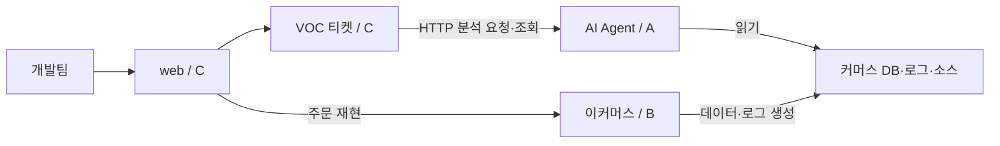

# 3인 랄프톤 GitHub 협업 가이드

이 문서는 AI Agent, 이커머스 애플리케이션, VOC 티켓 관리·AI 연동을 세 명이 나누어 구현하는 작업 기준이다. 저장소는 하나를 사용하고, 사용자가 정한 방식에 따라 모든 개발을 `main`에서 진행한다. 각자 자신의 PC에 clone해서 작업한다. 같은 PC에서 여러 개발 에이전트를 실행할 때에도 독립된 clone을 사용해 각자의 `main`과 작업 파일을 분리한다.

현재는 설계와 협업 템플릿을 준비한 단계다. `sanghyo-lab`의 GitHub 인증과 이 저장소의 쓰기 권한을 확인했다. 팀원 초대, Issue 생성, CI와 자동 실행은 아직 설정하지 않았다.

## 1. 담당 범위

| 담당 | 역할 | 주로 수정할 경로 | 완성할 결과 |
| --- | --- | --- | --- |
| A | AI Agent | `agent-app/`, `agent-core/`, `agent-infra/`, `docs/status/agent.md` | 조사 접수·진행·근거·보고서 API, DB·로그·소스·정책 조사 |
| B | 이커머스 애플리케이션 | `commerce-app/`, `commerce-core/`, `commerce-infra/`, `docs/business-policy.md`, `docs/status/commerce.md` | 주문·결제·쿠폰·재고·취소, 7개 장애 조건과 초기 데이터, 추적 로그 |
| C | VOC 티켓 관리·AI 연동 | `voc-app/`, `voc-core/`, `voc-infra/`, `web/`, `scenario-runner/`, `docs/status/voc.md` | 티켓 CRUD, 분석 요청·결과 연결, 문의·리포트 화면, 전체 흐름 검증 |

A·B·C는 역할 표기이며 실제 GitHub 계정은 배정 후 기록한다. API 문서와 루트 Gradle 설정, Compose, CI는 공통 파일이다. 초기 틀은 C가 취합하고 A·B가 각 앱의 실행 조건을 제공한다. 이후 공통 파일을 바꾸는 작업에는 영향을 받는 담당자를 명시한다.

쿠폰을 포함한 커머스 구현은 B가 맡는다. A는 커머스 코드를 읽고 조사 도구를 구현하며, 커머스 수정이 필요하면 근거와 필요한 변경을 B의 작업에 연결한다. C는 티켓을 관리하고 A의 HTTP API를 호출한다.

## 2. 실행 단위와 연결

Spring Boot 앱 세 개를 제안한다. 각 앱에 `app`, `core`, `infra` 모듈을 두고 `scenario-runner`를 더해 백엔드 Gradle 모듈은 10개다. `web`은 별도 Next.js 프로젝트다.



- B의 서버: 업무 데이터와 로그를 생성한다. 실행 버전의 소스 스냅샷도 제공한다.
- A의 서버: 조사 작업과 근거·보고서의 원본을 보관한다. `investigationId`를 발급한다.
- C의 서버: 티켓, 담당자, 업무 처리 상태, 분석 요청과 `investigationId` 연결을 보관한다. `ticketId`를 발급한다.
- 티켓 상태는 `OPEN`, `IN_PROGRESS`, `RESOLVED`를 사용한다. AI 조사 상태는 `QUEUED`, `RUNNING`, `COMPLETED`, `NEEDS_INPUT`, `FAILED`를 사용한다.
- 조사 완료 후 티켓 화면에 결과를 표시한다. 티켓의 `RESOLVED` 전이는 담당자가 실제 조치를 확인했을 때 수행한다.

앱 세 개의 실행·연동 비용을 줄이기 위해 PostgreSQL 한 인스턴스와 Compose 실행 환경을 공유한다. `commerce`, `agent`, `voc` 스키마와 마이그레이션은 각 담당 앱에서 관리한다. 첫 통합은 첫날에 끝내는 것을 목표로 한다.

## 3. 첫 한 시간에 맞출 규약

| 규약 | 작성·검토 | 포함할 내용 |
| --- | --- | --- |
| VOC → Agent HTTP 계약 | A 작성, C 검토 | 요청·응답, 상태, 오류, 재시도, 근거·보고서 JSON |
| 커머스 조회 스키마 | B 작성, A 검토 | 주문·결제·쿠폰·재고 테이블, 조회 필드, 데이터 초기화 방법 |
| 로그·실행 소스 규약 | B 작성, A 검토 | UTC 시각, 이벤트명, `buildId`, 요청·주문·상품 식별자, 로그·소스 위치 |
| VOC 화면 계약 | C 작성, A 검토 | 티켓과 조사 상태 표시, 추가 정보 입력, 근거 조회 |
| 실행·검증 규약 | C 취합, 전원 확인 | JDK·Gradle·Node 버전, 앱별 포트·환경 변수, 빌드·테스트 명령 |

HTTP 연결의 시작안은 [연동 계약 초안](integration-contract.md)에 정리했다. 구체적인 테이블 DDL과 OpenAPI·JSON 예제는 초기 계약 작업에서 확정한다. 확정한 규약과 동일한 예제 응답을 사용하면 C는 A의 구현 완료 전에 화면과 연동 코드를 만들 수 있다.

규약을 변경할 때에는 제공자와 사용자가 함께 변경을 확인한다. 필드 추가처럼 기존 호출이 계속 동작하는 변경을 우선한다. 필드 제거·이름 변경은 한 담당자가 양쪽 구현을 같은 커밋에 반영하거나, 각 단계에서도 연동이 유지되도록 순서를 정해 처리한다.

## 4. GitHub에서 소통하는 방식

| 수단 | 기록할 내용 |
| --- | --- |
| Issue | 목표, 담당, 완료 조건, 선행 작업, 막힌 이유 |
| `main`의 커밋 | 실제 코드 변경과 변경 이유, 관련 Issue |
| Issue의 진행 기록 | 변경 동작, 검증 결과, 연동 영향, 공유한 커밋 |
| 역할별 상태 문서 | 현재 작업, 제공 가능한 기능, 필요한 변경, 다음 작업 |
| 원격 `main` | 담당자들이 검증한 변경을 push해 공유하는 공통 기준 |

GitHub Issues는 작업과 논의를 추적하는 데 사용한다. 코드와 상태 문서는 `main`의 커밋으로 공유하고, 영향을 받는 담당자는 변경 내용과 검증 결과를 확인한다. [GitHub Issues](https://docs.github.com/en/issues/tracking-your-work-with-issues/about-issues)

작업은 다음 순서로 진행한다.

1. 역할별 Issue에서 작은 작업 하나를 고른다. 예: “분석 접수 API와 중복 요청 처리”.
2. 자신의 clone에서 `main`을 사용하고, 원격 변경과 계약·상태 문서를 먼저 확인한다.
3. 담당 범위에서 구현하고, 실제 실행한 검증과 결과를 기록한다.
4. 담당 파일과 상태 문서를 의미 있는 단위로 커밋하고 `origin/main`으로 일반 push한다.
5. 다른 사람이 먼저 push해 거절되면 원격 변경을 가져와 자신의 미공유 커밋에 반영하고, 필요한 검증 후 다시 push한다. 첫날에는 1~2시간마다 실제 연동을 확인한다.
6. 다음 작업 전 `main`의 새 변경과 계약·상태 문서를 확인한다.

커밋은 로컬 기록이고 push 이후 원격에서 공유된다. 원격 변경을 반영할 때에는 현재 작업을 먼저 보존한다. 공통 계약·루트 빌드·Compose처럼 여러 역할에 영향을 주는 파일은 작업 담당을 Issue에 먼저 기록하고 변경 순서를 맞춘다.

아래 시작 명령은 미커밋 변경과 미공유 로컬 커밋이 없는 상태에서 실행한다.

```bash
git switch main
git pull --ff-only origin main
```

변경한 담당 파일을 명시적으로 add하고 커밋한 뒤 다음 명령으로 공유한다.

```bash
git push origin main
```

다른 사람의 새 커밋 때문에 push가 거절되고 자신의 새 커밋이 아직 원격에 공유되지 않았다면, 깨끗한 작업 트리에서 다음과 같이 반영한다.

```bash
git fetch origin
git rebase origin/main
```

충돌이 있으면 해당 파일의 담당 범위와 계약을 확인해 해결하고 rebase를 완료한다. 영향을 받는 검증을 다시 실행한 뒤 `git push origin main`으로 공유한다. 원격에 이미 공유한 이력은 유지하고 강제 push는 사용하지 않는다. 예상과 다른 이력이나 브랜치 규칙에 따른 거절은 원인을 확인해 처리한다.

## 5. 개발 에이전트의 반복 작업

GitHub를 공유 기록으로 사용하려면 각 개발 에이전트가 원격 변경과 문서를 확인하는 절차를 실행해야 한다. 팀원 간 대화나 에이전트의 내부 기억은 각 실행 환경에 따로 남으므로, 다음 작업에 필요한 내용을 저장소에 기록한다.

각 담당자는 자신의 개발 에이전트에 다음 기준을 전달한다.

```text
이 저장소에서 맡은 역할과 이번 작업의 완료 조건을 확인한다.
docs/collaboration.md, docs/integration-contract.md, docs/architecture.md와
docs/status의 세 역할 상태 문서를 읽는다.

반복 단위:
1. 원격 main의 변경, 담당 Issue와 관련 커밋을 확인한다.
2. 현재 작업을 보존하고 필요한 통합 변경을 반영한다.
3. 담당 경로에서 작은 작업 하나를 구현한다.
4. 해당 변경에 필요한 검증을 실행하고 실제 결과를 기록한다.
5. 담당 상태 문서에 완료 사항, 연동 영향, 다음 작업을 갱신한다.
6. main에 커밋하고 일반 push로 공유한다. 동시 push로 거절되면 위 동기화 절차를 따른다.

다른 담당자의 구현이 필요하면 계약과 필요한 변경을 구체적으로 기록하고,
그동안 진행할 수 있는 독립 작업을 수행한다.
작업 수, 실행 시간, 모델 사용량의 한도와 종료 조건을 지킨다.
```

이 문서 자체는 스케줄러나 자동 실행 프로그램이 아니다. 실제 사용하는 에이전트 실행기에 위 반복과 종료 조건을 설정한다. GitHub 조회·push 권한도 각자의 계정으로 확인한다. 각 개발 에이전트는 독립된 clone의 `main`에서 작업한다.

상태 기록은 역할별 파일로 나눠 충돌을 줄인다. 공유된 진행 상황은 원격 `main`의 상태 파일과 관련 Issue에서 확인한다. 구현 중인 기능은 완료한 기능과 구분해 기록한다.

- [A — AI Agent 상태](status/agent.md)
- [B — 이커머스 상태](status/commerce.md)
- [C — VOC·연동 상태](status/voc.md)

## 6. 통합과 검증

C를 초기 통합 담당으로 제안한다. A·B는 자신의 앱을 빌드·실행할 수 있는 상태로 전달하고, C는 VOC → Agent → 커머스 근거 조회 → 리포트 표시 흐름을 연결한다. 모듈별 테스트는 각 담당자가 유지한다.

| 시점 | 함께 확인할 결과 |
| --- | --- |
| 첫 한 시간 | 소유 경로, 연동 계약 초안, 최소 테이블·로그 필드, 공통 실행 틀 |
| 첫날 오전 | 세 앱과 PostgreSQL 실행, 각 API의 예제 요청·응답 |
| 첫날 오후 | 티켓 1건에서 실제 조사·근거·보고서 표시까지 연결 |
| 둘째 날 오전 | 7개 VOC, 정상·정보 부족 사례, 중복 분석 요청·통신 실패 검증 |
| 둘째 날 오후 | Vercel 시연, 실제 결과표·리포트 완성 |

초기 CI는 `main` push에 백엔드 빌드·관련 테스트와 프론트 빌드가 실행되도록 구성한다. 각 담당자는 push 전에 관련 검증을 실행하고, 공유 후에도 CI 결과를 확인해 실패를 보완한다. 계약의 예제와 실제 API가 맞는지도 검증한다.

팀원에게 저장소 쓰기 권한을 부여하고 이 문서의 담당 경로를 기준으로 작업한다. 직접 push 방식을 기준으로 하며, 저장소에 이미 적용된 규칙은 확인 후 처리한다. 다른 팀원의 접근 권한이나 저장소 규칙은 아직 변경하지 않았다.

[작업 Issue 템플릿](../.github/ISSUE_TEMPLATE/task.md)을 이용해 완료 조건·연동 영향·검증 결과와 공유 커밋을 같은 형식으로 기록한다.
