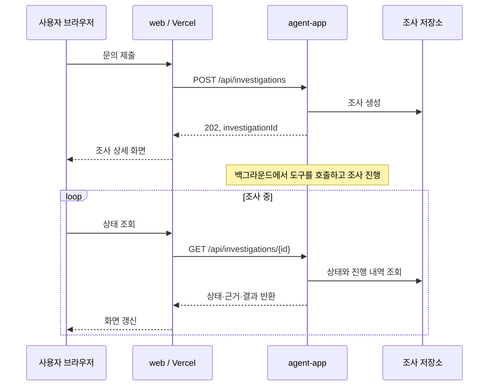
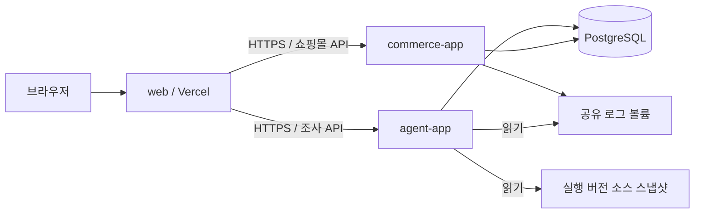

# 문의 화면과 Vercel 배포 설계

## 1. 구성

문의 입력, 분석 진행, 답변과 근거를 확인할 프론트 프로젝트 `web`을 추가한다. 이 문서는 설계이며, 프론트 코드나 배포 URL은 아직 생성하지 않았다.

- 프론트: Next.js App Router, React, TypeScript를 기본안으로 한다.
- 배포: Vercel에서 `web` 프로젝트를 빌드하고 제공한다. Next.js는 Vercel에서 지원하는 프레임워크다. [Vercel Next.js 문서](https://vercel.com/docs/frameworks/full-stack/nextjs)
- 백엔드: 기존 Gradle 모듈 7개와 Spring Boot 실행 앱 2개를 사용한다.
- 통신: 브라우저가 `web`의 같은 출처 API를 호출하고, Next.js Route Handler가 백엔드의 짧은 HTTP 요청을 중계한다.
- 조사 실행: Spring Boot의 작업 실행기에서 계속 수행하며, 진행 상태와 결과는 DB에 저장한다.

## 2. 필요한 화면

| 경로 | 목적 | 필수 구성 |
| --- | --- | --- |
| `/investigations` | 새 문의와 이전 조사 선택 | 문의 입력, 선택적 주문·상품·시간 정보, 조사 이력, 예시 문의 |
| `/investigations/[id]` | 진행 상태와 답변 확인 | 입력 문의, 실제 도구 실행 내역, 분석 결과, 근거 패널, 추가 정보 입력 |
| `/shop` | 문의 상황을 만들 최소 쇼핑몰 | 상품·재고 표시, 주문, 모의 결제, 주문 조회·취소 |

문의 화면은 왼쪽의 조사 이력, 중앙의 문의와 답변, 오른쪽의 근거 패널로 배치하는 안을 사용한다. 좁은 화면에서는 근거를 탭이나 펼침 영역으로 이동한다.

- 문의 입력: 자연어 설명을 기본으로 하고 주문번호·상품번호·발생 시각은 알고 있는 경우 입력한다.
- 예시 문의: 7개 시나리오의 문의 문구를 채워준다. 실제 장애 원인이나 평가 정답은 프론트 데이터에 포함하지 않는다.
- 진행 표시: 주문 데이터 조회, 로그 검색, 소스 읽기 등 실제 수행한 작업과 시간을 보여준다.
- 답변: 확인된 사실, 원인 후보, 해당 건 조치, 재발 방지안, 추가 확인 사항을 구분한다.
- 근거: 코드의 빌드·파일·줄 번호와 내용, 관련 로그, 주문·결제·재고 레코드를 열어본다.
- 추가 정보: `NEEDS_INPUT`이면 부족한 식별자나 시각을 입력받고, 이전 조사와 연결한 새 실행을 요청한다.
- 실패: 백엔드 연결 실패, 도구 실패, 분석 시간 초과를 각각 표시하고 재조회·재시도 동작을 제공한다.

근거 내용은 조사 결과에 연결된 증거 API로 조회한다. 브라우저에서 서버의 로컬 파일 경로를 직접 열도록 구성하지 않는다.

## 3. 프론트 디렉터리 제안

```text
web/
├── package.json
├── package-lock.json
├── next.config.ts
├── app/
│   ├── investigations/
│   │   ├── page.tsx
│   │   └── [id]/page.tsx
│   ├── shop/page.tsx
│   └── api/
│       ├── investigations/         # 조사 API 중계
│       └── commerce/               # 쇼핑몰 API 중계
├── components/
│   ├── inquiry-form.tsx
│   ├── investigation-history.tsx
│   ├── investigation-progress.tsx
│   ├── investigation-report.tsx
│   └── evidence-panel.tsx
└── lib/
    ├── api-types.ts
    ├── client-api.ts
    └── backend.ts                 # 서버에서만 사용하는 백엔드 연결
```

`web`은 Gradle 하위 프로젝트에 포함하지 않는다. 프론트와 백엔드는 HTTP API·JSON 형식을 통해 연결하며, 프론트의 타입 정의를 해당 계약과 맞춘다.

## 4. 요청과 응답 흐름



기본안은 약 1~2초 간격으로 상태를 조회하고 종료 상태에서 멈추는 방식이다. 통신 실패 시 간격을 늘리고, 조회 실패만으로 백엔드 작업을 실패로 단정하지 않는다. 새로고침 후에는 URL의 조사 ID로 상태를 복원한다. 추가 정보로 재조사할 때에는 이전 조사 ID를 함께 전송한다. 백엔드는 이전 문의와 대상 정보를 불러와 추가 입력을 반영하고 새 조사 이력을 연결한다.

| API 계약 | 용도 |
| --- | --- |
| `POST /api/investigations` | `message`, 선택적 `context`, 선택적 `previousInvestigationId`로 조사 시작; `202`와 조사 ID 반환 |
| `GET /api/investigations` | 최근 조사 이력 |
| `GET /api/investigations/{id}` | 상태, 수행 작업, 추가 정보 요청, 최종 보고서 |
| `GET /api/investigations/{id}/evidence/{evidenceId}` | 해당 조사에 연결된 근거의 실제 내용 |

Next.js Route Handler는 HTTP 메서드별 요청 처리를 제공하므로 이 중계 계층을 구현할 수 있다. 모델 호출과 조사 반복은 `agent-app`에 둔다. 상태·근거 응답은 캐시하지 않도록 설정한다. [Next.js Route Handler 문서](https://nextjs.org/docs/app/getting-started/route-handlers)

## 5. 배포 연결



백엔드 배포 기본안은 팀이 사용할 수 있는 호스트에서 Docker Compose로 Spring Boot 두 앱과 PostgreSQL을 실행하는 것이다. 로그 볼륨은 커머스에서 쓰고 에이전트에서 읽으며, 실행 소스 스냅샷은 에이전트에 읽기 전용으로 제공한다. Vercel에서 접근 가능한 백엔드 HTTPS 주소를 준비한다. 프론트의 Vercel 배포와 백엔드의 네트워크 접근 가능 여부를 각각 확인한다.

여기서 배포를 나누는 목적은 기존 Java 실행 방식, 조사 작업의 수명, 공유 로그·소스 접근을 같은 백엔드 환경에서 관리하기 위해서다. 구체적인 서버 사업자와 주소는 사용할 수 있는 환경을 확인한 뒤 결정한다.

Vercel 프로젝트 설정안:

| 항목 | 값 |
| --- | --- |
| Root Directory | `web` |
| Framework | Next.js |
| Install / Build | `web`의 잠금 파일과 `package.json` 스크립트를 기준으로 설정 |
| Preview | 해커톤 검증용 백엔드 주소에 연결 |
| Production | 발표용으로 고정한 백엔드 주소에 연결 |

Vercel은 저장소의 하위 디렉터리를 프로젝트 Root Directory로 지정할 수 있고, 환경 변수를 Preview·Production에 나누어 적용할 수 있다. [모노레포 문서](https://vercel.com/docs/monorepos), [환경 변수 문서](https://vercel.com/docs/environment-variables)

서버 환경 변수의 제안 이름:

- `AGENT_API_BASE_URL`: 조사 백엔드 주소.
- `COMMERCE_API_BASE_URL`: 쇼핑몰 백엔드 주소.
- `BACKEND_SERVICE_TOKEN`: 중계 서버와 백엔드 간 인증을 사용할 경우의 서버 전용 값.

LLM API 키와 DB 접속 정보는 Spring Boot 백엔드에서 관리한다. Next.js에서는 `NEXT_PUBLIC_` 접두사의 값이 브라우저 번들에 포함될 수 있으므로 서버 전용 값은 해당 접두사를 사용하지 않는다. 내부 도구의 사용자 접근 제어는 화면과 중계 API에 같이 적용하며, 서비스 토큰은 사용자 인증과 별도로 다룬다. [Next.js 환경 변수 문서](https://nextjs.org/docs/app/guides/environment-variables)

## 6. 이틀 동안의 연결 순서

1. 문의·조사 결과·근거 JSON을 먼저 합의한다.
2. C가 `web`의 문의와 결과 화면을 만들고, A·B가 실제 주문·조사 API를 구현한다. UI 개발용 예시 응답은 개발용으로 명확하게 표시한다.
3. 로컬에서 문의 → 조사 ID → 상태 조회 → 답변·근거 표시를 한 번 연결한다.
4. 백엔드 HTTPS 주소를 준비하고 `web`을 Vercel Preview에 배포해 같은 요청을 실행한다.
5. 7개 시나리오와 정보 부족·실패 상태, 새로고침 후 조회를 확인한다.

완료 기준은 Vercel URL에서 입력한 문의가 실제 Spring Boot 에이전트의 조사 결과와 근거로 표시되는 것이다. 프론트 화면만 배포한 상태와 실제 분석까지 연결된 상태를 구분해 기록한다.
