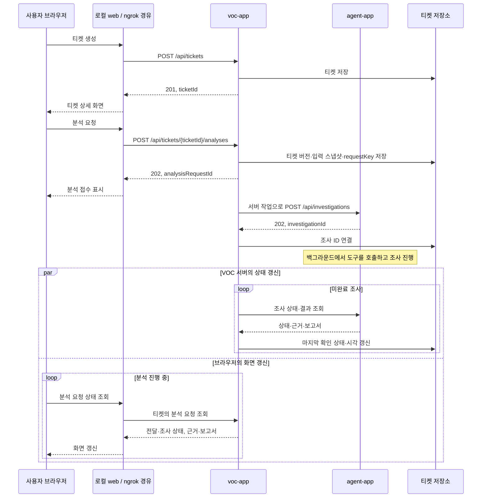
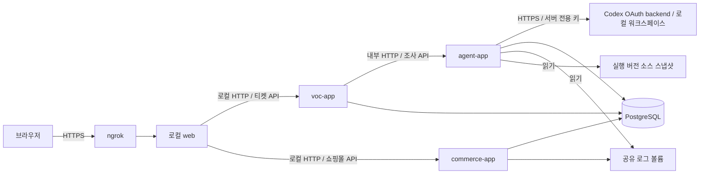

# 문의 화면과 ngrok 로컬 데모 설계

> 2026-09-21 최신 사용자 지시: **로컬 개발·데모=Codex OAuth, 배포=OpenAI API key, 자동 테스트=test/mock**.
> [구현된 실행 계약](llm-runtime.md)을 우선 적용한다. 아래 과거 OpenAI 로컬 데모·Spring AI 계획은 인증/전송 선택의 근거로 사용하지 않는다.
> 로컬의 API key fallback과 배포의 OAuth 파일 조회는 금지한다. $50 API 크레딧은 배포에만 사용한다.


## 1. 구성

VOC 티켓 등록·처리 상태, 분석 진행, 답변과 근거를 확인할 프론트 프로젝트 `web`을 추가한다. [김아름](roles/kim-areum-voc.md)이 VOC 서버와 프론트·AI 연동을 담당한다. 이 문서는 설계이며, 프론트 코드나 배포 URL은 아직 생성하지 않았다.

- 프론트: Next.js App Router, React, TypeScript를 기본안으로 한다.
- 데모: `web`을 시연 PC에서 빌드·실행하고 ngrok로 HTTPS 진입점 하나를 제공한다. [로컬 데모 절차](ngrok-local-demo.md)를 따른다.
- 백엔드: Gradle 모듈 10개와 Spring Boot 실행 앱 3개를 사용한다.
- 통신: 브라우저가 `web`의 같은 출처 API를 호출하고, Next.js Route Handler가 VOC·커머스의 짧은 HTTP 요청을 중계한다. Agent 연동은 VOC 서버에서 수행한다.
- 조사 실행: Agent의 작업 실행기에서 계속 수행하며, 진행 상태와 결과는 Agent DB에 저장한다. VOC 서버는 티켓·분석 요청과 조사 ID를 연결한다.

## 2. 필요한 화면

| 경로 | 목적 | 필수 구성 |
| --- | --- | --- |
| `/tickets` | 티켓 등록·목록 | 제목·문의 입력, 선택적 주문·상품·시간 정보, 담당자·상태 필터, 예시 문의 |
| `/tickets/[id]` | 티켓 처리와 분석 결과 | 티켓 상태·담당자 수정, 분석 요청·이력, 실제 도구 실행 내역, 리포트·근거, 추가 정보 입력 |
| `/shop` | 문의 상황을 만들 최소 쇼핑몰 | 상품·재고 표시, 주문, 모의 결제, 주문 조회·취소 |

티켓 상세 화면은 왼쪽의 분석 이력, 중앙의 문의와 답변, 오른쪽의 근거 패널로 배치하는 안을 사용한다. 좁은 화면에서는 근거를 탭이나 펼침 영역으로 이동한다.

- 문의 입력: 자연어 설명을 기본으로 하고 주문번호·상품번호·발생 시각은 알고 있는 경우 입력한다.
- 티켓 관리: `OPEN`, `IN_PROGRESS`, `RESOLVED` 상태와 담당자를 관리한다. AI 분석 상태는 별도로 표시하고, 해결 처리는 담당자가 조치를 확인한 후 수행한다.
- 예시 문의: 7개 시나리오의 문의 문구를 채워준다. 실제 장애 원인이나 평가 정답은 프론트 데이터에 포함하지 않는다.
- 진행 표시: 주문 데이터 조회, 로그 검색, 소스 읽기 등 실제 수행한 작업과 시간을 보여준다.
- 답변: 확인된 사실, 원인 후보, 해당 건 조치, 재발 방지안, 추가 확인 사항을 구분한다.
- 근거: 코드의 빌드·파일·줄 번호와 내용, 관련 로그, 주문·결제·재고 레코드를 열어본다.
- 추가 정보: `NEEDS_INPUT`이면 부족한 식별자나 시각을 입력받고, 이전 조사와 연결한 새 실행을 요청한다.
- 실패: 백엔드 연결 실패, 도구 실패, 분석 시간 초과를 각각 표시하고 재조회·재시도 동작을 제공한다.

근거 내용은 조사 결과에 연결된 증거 API로 조회한다. 브라우저에서 서버의 로컬 파일 경로를 직접 열도록 구성하지 않는다.

## 3. 프론트 디렉터리 제안

```text
web/
├── package.json
├── package-lock.json
├── next.config.ts
├── app/
│   ├── tickets/
│   │   ├── page.tsx
│   │   └── [id]/page.tsx
│   ├── shop/page.tsx
│   └── api/
│       ├── tickets/                # 티켓·분석·근거 API 중계
│       └── commerce/               # 쇼핑몰 API 중계
├── components/
│   ├── inquiry-form.tsx
│   ├── ticket-list.tsx
│   ├── ticket-status.tsx
│   ├── investigation-history.tsx
│   ├── investigation-progress.tsx
│   ├── investigation-report.tsx
│   └── evidence-panel.tsx
└── lib/
    ├── api-types.ts
    ├── client-api.ts
    └── backend.ts                 # 서버에서만 사용하는 백엔드 연결
```

`web`은 Gradle 하위 프로젝트에 포함하지 않는다. 프론트와 백엔드는 HTTP API·JSON 형식을 통해 연결하며, 프론트의 타입 정의를 해당 계약과 맞춘다.

## 4. 요청과 응답 흐름



브라우저는 약 1~2초 간격으로 VOC의 분석 요청 상태를 조회하고 종료 상태에서 멈춘다. 통신 실패 시 간격을 늘리고 마지막 확인 시각과 조회 오류를 표시한다. 새로고침 후에는 URL의 티켓 ID와 선택한 분석 요청 ID로 이력을 복원한다. VOC의 서버 작업은 브라우저를 닫아도 요청 전달·Agent 상태 갱신을 계속한다. 요청 키와 입력 스냅샷을 저장해 응답 유실 시에도 같은 분석에 연결한다.

티켓 수정 시 화면에서 확인한 `expectedVersion`, 분석 요청 시 `ticketVersion`을 전달한다. 버전 충돌은 최신 티켓을 불러와 확인하게 한다. 추가 정보로 재조사할 때에는 티켓 내용을 보완한 뒤 새 버전·요청 키와 이전 조사 ID를 함께 전송한다. 기존 조사 결과를 보존하고 새 분석 이력을 연결한다. 전달 실패의 수동 재시도에는 저장된 키·버전·이전 조사 ID를 재사용한다.

| API 계약 | 용도 |
| --- | --- |
| `GET /api/assignees` | 배정할 담당자의 내부 ID·표시 이름 |
| `POST /api/tickets`, `GET /api/tickets` | 티켓 생성·목록 조회 |
| `GET /api/tickets/{ticketId}`, `PATCH /api/tickets/{ticketId}` | 티켓 상세·업무 상태·담당자 관리 |
| `POST /api/tickets/{ticketId}/analyses` | 조사 요청 저장; `202`와 분석 요청 ID 반환 |
| `GET /api/tickets/{ticketId}/analyses/{analysisRequestId}` | 전달·조사 상태, 수행 작업, 추가 정보 요청, 최종 보고서 |
| `GET /api/tickets/{ticketId}/analyses/{analysisRequestId}/evidence/{evidenceId}` | 해당 티켓·분석에 연결된 근거의 실제 내용 |

티켓·분석의 정확한 DTO와 JSON 예제, 요청 키·상태·오류 처리는 [VOC·Agent 연동 계약](integration-contract.md)을 따른다. `/shop`과 시나리오 실행이 사용하는 API는 [커머스 인터페이스](commerce-interface.md)를 따른다.

Next.js Route Handler는 HTTP 메서드별 요청 처리를 제공하므로 이 중계 계층을 구현할 수 있다. 모델 호출과 조사 반복은 `agent-app`에 둔다. 상태·근거 응답은 캐시하지 않도록 설정한다. [Next.js Route Handler 문서](https://nextjs.org/docs/app/getting-started/route-handlers)

## 5. 배포 연결



데모 PC에서 web과 Docker Compose의 Spring Boot 세 앱·PostgreSQL을 실행한다. 로그 볼륨은 커머스에서 쓰고 Agent에서 읽으며 실행 소스·정책도 읽기 전용으로 제공한다. 로컬 web 한 곳만 ngrok에 연결하고, web 서버는 로컬 VOC·commerce API에 접근한다. Agent는 기존 Compose 내부 주소를 사용한다.

모델 추론은 로컬 Agent가 Codex OAuth backend로 요청한다. 프로모션 API 크레딧은 배포에서만 사용하며 [분리된 실행 계약](llm-runtime.md)을 적용한다. OAuth 자격증명을 배포 산출물에 넣지 않는다.

로컬 web 실행 설정안:

| 항목 | 값 |
| --- | --- |
| 실행 디렉터리 | `web` |
| Framework | Next.js |
| Install / Build | `web`의 잠금 파일과 `package.json` 스크립트를 기준으로 설정 |
| 수신 주소 | `127.0.0.1:3000` |
| 외부 접속 | ngrok가 제공하는 HTTPS URL → 로컬 web |

실행·인증·공개 경로·재연결 검증은 [ngrok 로컬 데모 절차](ngrok-local-demo.md)를 따른다. Vercel 배포는 이번 데모의 선행 조건이 아니다.

서버 환경 변수의 제안 이름:

- `VOC_API_BASE_URL`: 호스트에서 실행하는 web 서버의 `http://127.0.0.1:8082`. 실제 VOC_PORT에 맞춘다.
- `COMMERCE_API_BASE_URL`: web 서버의 `http://127.0.0.1:8080`. 실제 COMMERCE_PORT에 맞춘다.
- `BACKEND_SERVICE_TOKEN`: 중계 서버와 백엔드 간 인증을 사용할 경우의 서버 전용 값.
- `AGENT_BASE_URL`: VOC 서버에서 사용하는 기존 Compose 설정 `http://agent:8080`.
- `AGENT_SERVICE_TOKEN`: VOC → Agent 인증에 사용할 경우 VOC 서버에서 관리하는 값.

LLM API 키와 DB 접속 정보는 Spring Boot 백엔드에서 관리한다. Next.js에서는 `NEXT_PUBLIC_` 접두사의 값이 브라우저 번들에 포함될 수 있으므로 서버 전용 값은 해당 접두사를 사용하지 않는다. 내부 도구의 사용자 접근 제어는 화면과 중계 API에 같이 적용하며, 서비스 토큰은 사용자 인증과 별도로 다룬다. [Next.js 환경 변수 문서](https://nextjs.org/docs/app/guides/environment-variables)

## 6. 이틀 동안의 연결 순서

1. 티켓·분석 요청·조사 결과·근거 JSON을 먼저 합의한다.
2. 김아름이 VOC와 `web`의 티켓·결과 화면을 만들고, 한재홍이 조사 API, 이상효가 커머스 API를 구현한다. UI 개발용 예시 응답은 개발용으로 명확하게 표시한다.
3. 로컬에서 티켓 → 분석 요청 → Agent 조사 → 상태 조회 → 답변·근거 표시를 한 번 연결한다.
4. 로컬 web·중계·접근 제어를 준비하고 ngrok HTTPS URL에서 같은 요청을 실행한다. 내부 서비스 주소와 OpenAI endpoint는 유지한다.
5. 7개 시나리오와 정보 부족·실패 상태, 중복 요청, 티켓 상태 전이, 새로고침 후 조회를 확인한다.

데모 연결 완료 기준은 ngrok URL에서 입력한 문의가 로컬 Spring Boot Agent의 실제 조사 결과와 근거로 표시되는 것이다. 화면 접속만 되는 상태와 실제 분석까지 연결된 상태를 구분해 기록한다.
