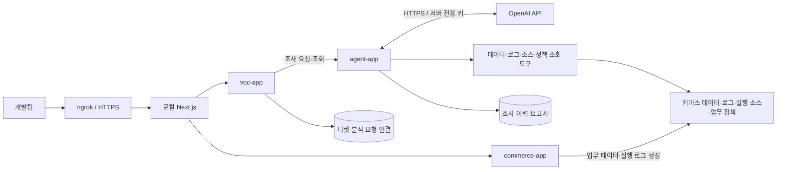

# JDD — 이커머스 VOC 조사 에이전트 해커톤 보고서

> 문서 상태: 구현·검증 진행 중인 제출 초안 · 작성일: 2026-09-21
>
> 커머스 업무와 일곱 독립 재현, Agent 접수·실행기·조회 도구·근거 저장을 구현했다. 실제 모델 조사·VOC/화면 통합과 최종 리더 승인은 진행 중이다. 아래에서 실제 업무 재현, 모의 모델 검증, 실제 AI 품질 검증을 구분한다. `미측정`과 `미검증`은 결과가 아직 없다는 뜻이다.

## 1. 프로젝트 개요

| 항목 | 내용 |
| --- | --- |
| 프로젝트 | JDD — 이커머스 VOC 조사 에이전트 |
| 개발 기간·인원 | 2일, 3명 |
| 사용자 | 이커머스 운영 문의를 조사하는 개발팀 |
| 목표 | 소스코드·로그·데이터를 찾고 대조하는 시간을 줄이고, 근거를 확인할 수 있는 원인 분석과 해결안을 제공한다. |
| 핵심 산출물 | 커머스 데모 앱, VOC 조사 에이전트, VOC 티켓 관리·연동, 문의·근거 화면, 7개 재현 시나리오, 검증 결과 |
| 저장소 | [sanghyo-lab/jdd](https://github.com/sanghyo-lab/jdd) |
| 데모 URL·시연 영상 | 배포·녹화 후 기입 |

JDD는 자연어 문의를 입력받아 관련 주문과 결제·쿠폰·재고 데이터를 찾고, 같은 요청의 로그와 실행 버전의 코드를 연결해 조사하는 개발팀 내부 도구다. 에이전트는 확인한 사실과 원인 후보를 구분하고, 해당 문의에 대한 조치와 재발 방지 수정안을 근거와 함께 제시한다.

해커톤에서는 작은 이커머스 앱에 재현 가능한 장애 조건을 준비한다. 같은 조사 에이전트로 7개 문의를 분석하고, 사람이 직접 조사하는 경우와 비교해 분석 품질과 소요 시간을 평가한다.

## 2. 해결하려는 문제

개발자는 “결제했는데 주문이 대기 중이다”와 같은 문의를 받으면 대상 주문을 식별하고, DB 상태와 결제 기록을 조회하고, 관련 로그를 찾은 뒤 처리 코드를 확인해야 한다. 조사 결과를 다른 개발자가 검토할 수 있도록 정리하는 작업도 필요하다.

이 프로젝트는 다음 작업을 지원한다.

- 문의의 주문·상품·요청 식별자와 발생 시각을 이용해 조사 범위를 좁힌다.
- 데이터, 로그, 코드, 업무 정책을 조회하고 서로 일치하는지 확인한다.
- 원인 후보마다 근거를 연결해 개발자가 원문을 확인하도록 한다.
- 근거가 부족하면 필요한 정보를 요청하고, 확인한 범위까지 결과를 남긴다.

## 3. MVP 범위와 기술 선택

커머스는 상품 조회, 주문, 모의 결제, 쿠폰, 재고 예약·반환, 전체 취소·모의 환불을 제공한다. 에이전트는 조사 접수, 도구를 이용한 조사, 진행 상태와 분석 보고서 저장·조회를 담당한다. VOC 앱의 티켓·담당자·처리 상태·버전 충돌은 구현되었고 AI 분석 요청·결과 연결은 담당자가 이어 구현한다. 프론트는 티켓·근거 화면과 주문 재현용 최소 화면을 제공한다.

| 영역 | 현재 구현·선택 | 검증 범위 |
| --- | --- | --- |
| 백엔드 | Java 21, Spring Boot 4.1.1, Spring MVC | 전체 Gradle check·세 앱 실행 |
| AI 연결 | 모델 포트와 제한 있는 도구 반복 실행기 | 모의 모델로 영속 실행·오류·근거 저장; 실제 제공자 검증은 미수행 |
| 저장·조회 | PostgreSQL 17.6, Spring JDBC | 실제 업무 트랜잭션·SELECT 전용 조사 계정 |
| 스키마 관리 | Flyway | 각 앱 스키마와 마이그레이션 |
| 프론트 | Next.js·React·TypeScript 계획 | 담당 구현·실제 화면 검증 대기 |
| 빌드·실행 | Gradle Wrapper 9.3.1, Docker Compose, BuildKit | 세 앱 재빌드·HTTP/DB/근거 볼륨 smoke |
| 검증 | JUnit·H2, Python HTTP/실제 PostgreSQL 실행기 | 계산·상태·잘못된 입력·독립 동시 트랜잭션·재시작 복구 |

버전과 의존성은 저장소의 빌드 파일·Wrapper·Compose에 고정되어 있다. 기술 선택만으로 업무·실제 모델·화면 완료를 주장하지 않는다.

데모 제공자는 OpenAI이며 프로모션 적용 조직·프로젝트의 API 키를 사용한다. 모델명·실제 접근·도구 호출은 검증한 뒤 결과에 기록한다. 공개 접속은 [ngrok 로컬 데모 절차](ngrok-local-demo.md)를 따르며 구성 선택을 실제 실행 완료로 표시하지 않는다.

## 4. 시스템 구조



시연 PC에서 Next.js·Spring Boot 앱 세 개·PostgreSQL을 실행하고 ngrok로 Next.js 진입점 하나를 연결한다. Next.js는 티켓·분석 요청을 로컬 VOC로 중계하고, VOC가 내부 Agent를 호출해 조사 ID를 연결한다. 조사 작업은 `agent-app`에서 계속 수행하며 OpenAI API를 이용한다. VOC의 상태 조회를 통해 진행 내역과 보고서를 화면에 표시한다.

| 모듈 | 책임 |
| --- | --- |
| `commerce-app` | 커머스 API와 실행 설정 |
| `commerce-core` | 주문·결제·쿠폰·재고·취소 업무 모델과 유스케이스 |
| `commerce-infra` | 업무 데이터 저장, 마이그레이션, 모의 결제 연동 |
| `agent-app` | 조사 API, 작업 실행, 모델 접속 설정 |
| `agent-core` | 조사 흐름, 도구 정의, 근거와 보고서 모델 |
| `agent-infra` | DB·로그·소스·정책 조회, 조사 이력 저장 |
| `voc-app` | 티켓 API와 분석 요청 전달·상태 갱신 작업 실행 |
| `voc-core` | 티켓·담당자·처리 상태와 분석 연동 유스케이스 |
| `voc-infra` | 티켓·분석 요청 저장, Agent HTTP 클라이언트 |
| `scenario-runner` | 재현 데이터 준비, 요청 실행, 결과 검증 |

백엔드 Gradle 모듈은 10개이며 `web`은 별도 프론트 프로젝트다. PostgreSQL은 `commerce`, `agent`, `voc` 스키마를 구분하고, 에이전트의 커머스 조회에는 SELECT 권한을 사용한다. 상세 의존성과 배포 흐름은 [구조 설계](architecture.md)와 [프론트·배포 설계](frontend-deployment.md)에 정리했다.

## 5. 에이전트의 조사 과정과 분석 리포트

1. 개발자가 문의와 알고 있는 주문·상품 식별자, 발생 시각으로 VOC 티켓을 만든다.
2. VOC 서버가 분석 요청을 저장해 Agent에 전달하고, 반환된 조사 ID를 티켓에 연결한다. Agent가 백그라운드 조사를 시작한다.
3. 모델이 필요한 조회 도구를 선택하면 앱이 실행하고 반환값과 출처를 저장한다.
4. 추가 조사가 필요하면 조회를 이어간다. 도구 호출 횟수와 전체 실행 시간을 제한한다.
5. 확인한 사실, 원인 후보, 조치와 수정안을 구조화된 보고서로 저장한다.
6. 개발자가 화면에서 보고서와 인용된 근거를 확인한다.

현재 `InvestigationRunner`가 모델 포트·8개 조회 도구·영속 근거 저장을 연결한다. 도구 결과를 DB에 저장한 뒤 모델에 전달하고, 보고서의 evidenceId를 검사한다. DB는 제한된 매개변수 조회, 로그는 상관 ID와 범위 검색, 소스는 buildId·manifest 해시 검증을 사용한다. 기본 모델은 DISABLED이며 실제 OpenAI 연결·조사 품질은 별도 검증해야 한다.

문의별 분석 리포트는 다음 내용을 포함하도록 설계한다.

| 항목 | 내용 |
| --- | --- |
| 문의 요약·조사 대상 | 문의 내용, 조사 ID, 주문·상품·시간 범위 |
| 확인된 사실 | 실제 조회한 데이터와 관측 결과 |
| 원인 후보 | 관측 결과를 설명하는 원인과 판단 근거, 아직 확인하지 못한 부분 |
| 근거 | DB 레코드 식별자, 로그 위치, 소스의 빌드·파일·줄 번호를 가진 `evidenceId` 참조 |
| 해당 건 조치 | 불일치 주문·환불·쿠폰·재고에 필요한 처리 제안 |
| 재발 방지 | 코드 또는 정책 수정안과 회귀 검증 방법 |
| 추가 확인 사항 | 부족한 정보와 다음 조사에 필요한 입력 |

`COMPLETED`는 조사가 종료됐다는 뜻이며 장애가 수정됐다는 뜻은 아니다. 티켓의 `RESOLVED`는 담당자가 실제 조치를 확인한 뒤 지정한다. 정보가 부족하면 `NEEDS_INPUT`, 도구 오류 등으로 조사를 완료하지 못하면 `FAILED`로 표시한다. 도구 실행 내역에는 실제 실행한 작업과 결과 요약을 남긴다.

## 6. 문의 시나리오와 시연 계획

아래 일곱 결함을 실제 커머스에 구현하고 독립 재현했다. AI의 원인 판단·해결안 평가는 아직 미검증이다. 원인과 기대 결과의 상세 기준은 [시나리오 문서](voc-scenarios.md)에 있다. 이 보고서와 평가 자료는 에이전트의 조회 대상에 포함하지 않는다. 에이전트에는 문의, 식별자, 정상 업무 정책과 실제 조회 도구를 제공한다.

| ID | 문의 | 조사에서 연결할 근거 | 현재 검증 상태 |
| --- | --- | --- | --- |
| VOC-01 | 결제했는데 주문이 결제 대기 상태다. | 승인 기록, 주문 상태, 이벤트 로그, 상태 전이 코드 | 실제 업무 3/3회; AI 미검증 |
| VOC-02 | 최소 주문금액과 같은 금액인데 쿠폰이 거절된다. | 업무 정책, 주문금액, 거절 로그, 비교식 | 실제 업무 3/3회; AI 미검증 |
| VOC-03 | 10% 쿠폰의 할인금액이 0원이다. | 할인 정책, 계산 결과, 계산 로그, 정수 나눗셈 코드 | 실제 업무 3/3회; AI 미검증 |
| VOC-04 | 재시도 후 같은 주문이 두 개 생겼다. | 체크아웃 키, 주문 두 건, 요청 로그, 중복 처리 경로 | 실제 업무 3/3회; AI 미검증 |
| VOC-05 | 취소 후 환불이 진행되지 않는다. | 취소 상태, 환불 기록, 일시 오류 로그, 재처리 경로 | 실제 업무 3/3회; AI 미검증 |
| VOC-06 | 취소 후 쿠폰이 복원되지 않는다. | 취소·환불 상태, 쿠폰 유효기간·사용 기록, 후처리 코드 | 실제 업무 3/3회; AI 미검증 |
| VOC-07 | 재고 1개에 주문 2건이 성공했다. | 초기 재고, 동시 요청 로그, 주문·예약 이력, 차감 코드 | 실제 업무 20/20회; AI 미검증 |

대표 시연은 VOC-07로 구성한다. 테스트용 동기화 지점에서 두 요청이 재고 1개를 각각 확인한 다음 차감하도록 실행 순서를 제어한다. 조사 에이전트가 초기 재고와 성공한 주문 수량, 두 요청의 로그, 차감 코드를 대조해 경쟁 조건을 설명하는지 확인한다.

재발 방지 제안의 검증 기준은 “재고 1개에 서로 다른 주문 요청 2건을 보내면 성공 1건, 재고 부족 1건, 잔여 재고 0개”다. 수정 구현을 검증할 때에는 취약 경로용 동기화 지점을 해제하고 요청 시작을 맞춘다. 재고 2개인 대조 사례에서는 두 주문이 모두 성공해야 한다. 현재 의도한 취약 경로의 20회 재현과 순차/충분 재고/시간 초과 복구 대조를 확인했다. 수정 전후 비교 버전은 구현하지 않았으며 의도한 결함은 보존했다.

시연에서는 문의 제출, 실제 도구 실행, 분석 결과, DB·로그·코드 근거 열람을 순서대로 보여준다. 수정 전후 비교를 구현했다면 같은 조건의 검증 결과를 함께 제시한다.

## 7. 검증 방법과 결과 기록

### 평가 방법

- 각 시나리오는 초기화 후 독립적으로 실행한다. 정상 사례와 정보 부족 사례도 포함한다.
- 장애 재현 여부, 원인 판단, 근거의 실제 존재·내용 일치, 해결안의 적절성을 각각 기록한다.
- 평가자는 시나리오 문서의 기준과 실제 실행 산출물을 함께 확인한다. 존재하지 않는 근거나 근거와 맞지 않는 주장은 실패 항목으로 남긴다.
- 문의 문구와 식별자를 바꾼 경우에도 같은 근거에 맞게 조사하는지 확인한다.
- 수동 조사와 에이전트 조사에 동일한 정보와 동등한 재현 조건을 제공한다. 가능한 한 구현 담당자 외의 팀원이 검토하고, 담당자와 평가 순서를 기록한다.
- 소규모 팀이 이미 장애 원인을 아는 데서 생기는 영향을 한계로 기록한다. 반복 측정 시에는 다른 식별자와 동등한 사례를 사용하고 수동·에이전트 평가 순서를 교대한다.

### 시나리오별 결과표

| ID | 실제 장애 재현 | DB·로그·실행 소스 | 실제 AI 원인·해결안 | 실행 원문 |
| --- | --- | --- | --- | --- |
| VOC-01 | 3/3회 | 대조 통과 | 미검증 | `20260921T091646.380723Z-business.json` |
| VOC-02 | 3/3회 | 대조 통과 | 미검증 | `20260921T091646.380723Z-business.json` |
| VOC-03 | 3/3회 | 대조 통과 | 미검증 | `20260921T091646.380723Z-business.json` |
| VOC-04 | 3/3회 | 대조 통과 | 미검증 | `20260921T091646.380723Z-business.json` |
| VOC-05 | 3/3회 | 대조 통과 | 미검증 | `20260921T091646.380723Z-business.json` |
| VOC-06 | 3/3회 | 대조 통과 | 미검증 | `20260921T091646.380723Z-business.json` |
| VOC-07 | 20/20회 | 대조 통과 | 미검증 | `20260921T091900.980389Z-inventory.json` |

위 실행은 이상효 PC의 실제 PostgreSQL·HTTP에서 buildId `c09694cde1cd-643370744894`로 수행했다.
각 반복의 고유 식별자·응답·DB·로그 줄·소스 manifest는 `runtime/submission/commerce-reproductions/`의 원문에 있다.
결제/취소 각각 4개 동시 재전송과 실제 JVM 재시작 후 같은 키·새 키의 중복 방지는 `lifecycle-recovery-20260921.json`에 기록했다.
정상 카드 결제·환불, 쿠폰 경계·소유·기간·상한, 충분한 재고·순차 재고 부족·대기 시간 초과 롤백/복구도 통과했다.
정보 부족 문의, 실제 AI 조사, PC·모바일 화면은 미검증이다. HTTP/H2 입력·동시성·DB 실패 롤백 검사는 19개를 통과했다.

Agent 담당자의 별도 PC에서는 실제 커머스의 8개 도구 결과 25건 저장·원문 HTTP 재조회와 같은 접수 키의 동일 ID를 검증했다.
이는 모의 모델 2회이며 실제 AI 품질 검증은 아니다. [COMMERCE-002 인수 기록](discussions/DISC-20260921-commerce-001-inventory-evidence.md)에 담당자·조사 ID·산출물 위치를 남겼다.

실패 기록도 보존했다. 기본 DB의 TEMP 권한 의존, 지원하지 않는 HTTP 방식의 500 응답,
혼합 주문 초기화의 이웃 이력 삭제, 재현 설정을 상속한 단위 테스트 실패, 결제·환불 시각 정밀도 차이를 발견해 수정·재검증했다.
초기화 거절의 첫 종료 코드 처리도 실패하여 고쳤다. [리더 지적](status/lead-review.json) LEAD-001~006와 [커머스 상태](status/commerce.md)가 실패·수정·재검증 원문을 연결한다.

각 실행에는 시나리오 ID, 조사 ID, 앱의 `buildId`, 모델명·설정, 실행 시각, 검토자, 판정 이유를 남긴다. 반복 실행은 별도 행으로 기록한다.

### 시간과 품질 지표

| 지표 | 측정 기준 | 현재 결과 |
| --- | --- | --- |
| 재현 시나리오 수 | 독립적으로 재현된 장애 유형 수 / 계획한 7개 | 7 / 7 (실제 AI 평가와 별도) |
| 원인 판단 성공률 | 기준에 맞는 원인을 근거와 함께 제시한 실행 수 / 전체 장애 평가 실행 수 | 미측정 |
| 근거 유효율 | 실제로 존재하고 주장을 뒷받침하는 인용 수 / 전체 인용 수 | 미측정 |
| 정상 사례 오진율 | 정상 사례를 장애로 단정한 실행 수 / 전체 정상 사례 실행 수 | 미측정 |
| 수동 조사 시간 | 문의 확인부터 근거와 해결안 정리 완료까지의 시간 | 미측정 |
| 에이전트 응답 시간 | 조사 접수부터 결과 저장까지의 시간 | 미측정 |
| 사람의 후속 작업 시간 | 에이전트 결과를 확인·보완하고 해결안을 정리하는 데 든 시간 | 미측정 |

시간 절감은 성공 기준을 만족한 동등한 사례끼리 비교한다. 에이전트가 실패하거나 추가 정보가 필요했던 실행도 전체 품질 지표와 실행 기록에 포함한다. 종료된 실행 수와 실패 수를 함께 적고, 미실행을 성공으로 계산하지 않는다. 인용이 없거나 분모가 0인 지표는 `산출 불가`로 표시한다.

```text
에이전트 활용 총 소요 시간 = 에이전트 응답 시간 + 사람의 후속 작업 시간
소요 시간 절감률 = (수동 조사 시간 - 에이전트 활용 총 소요 시간) / 수동 조사 시간 × 100
```

초기 측정은 에이전트 결과를 받은 뒤 사람이 검토하는 순서로 진행해 시간의 중복 집계를 피한다. 개발자의 직접 작업 시간 절감도 별도로 비교한다. 사례별 원자료, 측정 횟수와 중앙값을 함께 제시하며, 실제 측정 전에는 절감률을 기입하지 않는다.

## 8. 역할 분담과 2일 일정

| 담당 | 구현 책임 | 보고서에 제공할 자료 |
| --- | --- | --- |
| 한재홍 — AI Agent | 조사 API·도구·근거·보고서와 분석 이력 | 도구 실행 사례, 원인·근거·해결안 검토 결과 |
| 이상효 — 이커머스 | 주문·결제·쿠폰·취소·재고, 스키마·로그·재현 데이터 | 업무 흐름, 7개 장애 재현 결과, 재고 검증 근거 |
| 김아름 — VOC·AI 연동 | 티켓·분석 연동, 프론트, 배포와 시나리오 실행 | 티켓·결과 화면, 데모 주소, 시나리오별 측정표 취합 |

각자 별도 clone의 `main`에서 작업하고, GitHub Issue·커밋·역할별 상태 문서로 완료 조건과 변경을 공유한다. 원격 변경을 반영하고 검증한 코드를 일반 push로 전달한다. 구현 범위는 [담당별 문서](roles/README.md), 운영 기준은 [3인 협업 가이드](collaboration.md), API 경계는 [VOC·Agent 인터페이스](integration-contract.md)와 [커머스 인터페이스](commerce-interface.md)를 따른다.

| 시점 | 구현·검증 목표 | 보고서 작업 |
| --- | --- | --- |
| 1일 차 오전 | 공통 모델·API·도구 계약, 세 앱과 DB, 모델 호출 확인 | 문제·목표·구조 초안을 구현 선택에 맞춰 갱신 |
| 1일 차 오후 | 문의 1건의 전체 흐름, 7개 재현 조건 준비 | 대표 조사 과정과 근거 산출물 보관 |
| 2일 차 오전 | 7개 시나리오, 정상·정보 부족 사례 검증 | 결과표와 시간 측정 기록 작성 |
| 2일 차 오후 | 실패 경로 보완, 데모 배포·리허설 | 마지막 1시간을 보고서 수치·링크·화면 확인과 제출 정리에 배정 |

## 9. 현재 성과와 한계

실행 가능한 커머스의 상품·주문·결제·쿠폰·재고·취소·환불, 일곱 시나리오의 합성 데이터·독립 재현과 업무 근거를 제공했다. Agent의 영속 접수·실행·조회 도구·보고서 검증과 비용 장부는 개발 검증 중이며 실제 모델·VOC/화면 통합은 남아 있다. 모든 역할과 리더는 IN_PROGRESS이며 DONE·APPROVED를 선언하지 않았다. 배포 URL과 조사 품질·시간 절감 실측치는 아직 없다.

해커톤 평가는 재현을 위해 설계한 작은 앱과 제한된 시나리오를 대상으로 한다. 결과는 해당 조건에서의 관찰로 제시한다. 실제 운영 도입에는 데이터량과 코드 규모 확대, 다른 장애 유형, 로그 누락·보존 기간, 접근 권한, 민감 정보 처리 등의 추가 검토가 필요하다.

제출본에는 실제 완료한 기능과 남은 기능, 시나리오별 성공·실패 원인, 측정 조건을 반영한다. 문서의 기대 결과는 실행 산출물과 대조해 갱신한다.

## 10. 산출물과 남은 제출 작업

| 산출물 | 위치 | 현재 상태 |
| --- | --- | --- |
| 실행·계약 | [루트 README](../README.md), [커머스 실행](../commerce-app/README.md), [인터페이스](commerce-interface.md) | 세 앱 기동과 커머스 재현 제공 |
| 합성 데이터·독립 재현 | `fixtures/commerce/VOC-01`~`VOC-07`, `reproduce_commerce.py`, `reproduce_inventory.py` | SQL·HTTP·기대 관측값과 실제 반복 결과 |
| 실제 근거 | `runtime/evidence/logs/commerce/<buildId>/`, `runtime/evidence/source/<buildId>/` | 해당 바이너리의 로그·소스 manifest |
| 실행 원문 | `runtime/submission/commerce-reproductions/`, `runtime/submission/commerce-20260921-resumed/commands/` | 성공·실패·명령·종료 코드·실행 시간 보존, Git 제외 |
| 실제 개발 세션 제출본 | `runtime/submission/commerce-20260921-resumed/session/` | 사용자/응답/도구의 실제 이벤트, 비밀 값 제거; 원본 위치·SHA·제외 항목 manifest, 요약과 구분 |
| 검토·인수 | `docs/status/commerce.md`, `lead.md`, `lead-review.json`, `docs/discussions/` | 단위 검토 진행, 최종 승인 미완료 |

실제 세션 제출본은 진행 중인 대화의 중간 캡처이며 종료 시 다시 내보낸다. 실행 로그·개인 정보·키는 Git에 넣지 않는다.
최종 제출에 다음 자료를 추가해야 한다.

- 팀원 이름과 실제 해커톤 일자
- 실행한 커밋·빌드 식별자, 확정한 의존성 버전과 모델명
- 배포 URL, 실행 방법, 문의·분석·근거 화면
- 7개 시나리오와 정상·정보 부족 사례의 실행 기록
- 수동 조사, 에이전트 응답, 사람의 후속 작업 시간 원자료
- 실패 사례와 남은 작업, 대표 시연 영상 또는 화면 자료

관련 설계: [아키텍처](architecture.md), [프론트·배포](frontend-deployment.md), [업무 정책](business-policy.md), [시나리오·검증 기준](voc-scenarios.md).
