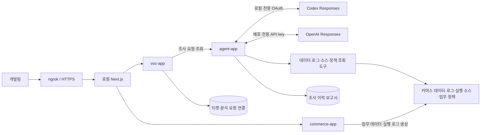

# JDD — 이커머스 VOC 조사 에이전트 해커톤 보고서

> 문서 상태: 구현·검증 진행 중인 제출 초안 · 갱신일: 2026-09-22 · 이상효 위임 제출 정리
>
> 커머스 업무와 일곱 독립 재현, Agent 접수·실행기·조회 도구·근거 저장, VOC 영속 티켓·분석 연동과 로그인·티켓 화면을 구현했다. 조사·리포트·근거·커머스 화면과 실제 HTTP runner도 통합했다. 담당자의 실제 모델 관측 API를 인수했으며 전체 실제 모델 품질과 최종 팀 검증은 진행 중이다. 아래에서 이상효 PC의 실행, 다른 담당자 PC의 인수 기록, 모의 응답 검증을 구분한다. `미측정`과 `미검증`은 결과가 아직 없다는 뜻이다.

## 1. 프로젝트 개요

| 항목 | 내용 |
| --- | --- |
| 프로젝트 | JDD — 이커머스 VOC 조사 에이전트 |
| 개발 기간·인원 | 2일, 3명 |
| 사용자 | 이커머스 운영 문의를 조사하는 개발팀 |
| 목표 | 소스코드·로그·데이터를 찾고 대조하는 시간을 줄이고, 근거를 확인할 수 있는 원인 분석과 해결안을 제공한다. |
| 핵심 산출물 | 커머스 데모 앱, VOC 조사 에이전트, VOC 티켓 관리·연동, 문의·근거 화면, 7개 재현 시나리오, 검증 결과 |
| 저장소 | [sanghyo-lab/jdd](https://github.com/sanghyo-lab/jdd) |
| 데모 URL·시연 영상 | 배포·녹화 후 기입 |

JDD는 자연어 문의를 입력받아 관련 주문과 결제·쿠폰·재고 데이터를 찾고, 같은 요청의 로그와 실행 버전의 코드를 연결해 조사하는 개발팀 내부 도구다. 에이전트는 확인한 사실과 원인 후보를 구분하고, 해당 문의에 대한 조치와 재발 방지 수정안을 근거와 함께 제시한다.

해커톤에서는 작은 이커머스 앱에 재현 가능한 장애 조건을 준비했다. 한재홍 PC에서 실제 모델의 VOC-07 한 건을 검수했고 정상 사례에서는 직접 인용 누락을 발견했다. 일곱 문의의 전체 품질 평가와 사람의 조사 시간 비교는 완료하지 않았다. 시간 절감률은 측정하지 않았다.

## 2. 해결하려는 문제

개발자는 “결제했는데 주문이 대기 중이다”와 같은 문의를 받으면 대상 주문을 식별하고, DB 상태와 결제 기록을 조회하고, 관련 로그를 찾은 뒤 처리 코드를 확인해야 한다. 조사 결과를 다른 개발자가 검토할 수 있도록 정리하는 작업도 필요하다.

이 프로젝트는 다음 작업을 지원한다.

- 문의의 주문·상품·요청 식별자와 발생 시각을 이용해 조사 범위를 좁힌다.
- 데이터, 로그, 코드, 업무 정책을 조회하고 서로 일치하는지 확인한다.
- 원인 후보마다 근거를 연결해 개발자가 원문을 확인하도록 한다.
- 근거가 부족하면 필요한 정보를 요청하고, 확인한 범위까지 결과를 남긴다.

## 3. MVP 범위와 기술 선택

커머스는 상품 조회, 주문, 모의 결제, 쿠폰, 재고 예약·반환, 전체 취소·모의 환불을 제공한다. 에이전트는 조사 접수, 도구를 이용한 조사, 진행 상태와 분석 보고서 저장·조회를 담당한다. VOC의 티켓·담당자·처리 상태·버전 충돌, 분석 입력 사본·이력 저장과 Agent 전달·조회·근거 중계도 구현했다. `495dbcc`의 web은 로그인·티켓 등록/목록/수정·충돌 비교·분석 이력 요약을 제공한다. 후속 통합은 조사 요청·보고서·근거 패널, `/shop`, 실제 HTTP runner와 조사별 모델 장부 조회를 제공한다. 전체 AI 결과 검증은 남아 있다.

| 영역 | 현재 구현·선택 | 검증 범위 |
| --- | --- | --- |
| 백엔드 | Java 21, Spring Boot 4.1.1, Spring MVC | 전체 Gradle check·세 앱 실행 |
| AI 연결 | 공통 모델 포트와 직접 Responses HTTP/SSE 어댑터: 로컬 Codex OAuth, 배포 OpenAI API, 테스트 mock | 전송·장부·근거 저장 검사; 한재홍 PC의 VOC-07 한 건 검수, 정상 보고서 직접 인용 미완성; 리더 PC 실제 모델 미검증 |
| 저장·조회 | PostgreSQL 17.6, Spring JDBC | 실제 업무 트랜잭션·SELECT 전용 조사 계정 |
| 스키마 관리 | Flyway | 각 앱 스키마와 마이그레이션 |
| 프론트 | Next.js 16.3.5·React 19.3.0·TypeScript | 실제 PC/모바일 문의·분석 실패·커머스 흐름 및 합성 보고서/4종 근거 화면 검증; 실제 모델 보고서 화면은 미검증 |
| 빌드·실행 | Gradle Wrapper 9.3.1, Docker Compose, BuildKit | 세 앱 재빌드·HTTP/DB/근거 볼륨 smoke |
| 검증 | JUnit·H2, Python HTTP/실제 PostgreSQL 실행기 | 계산·상태·잘못된 입력·독립 동시 트랜잭션·재시작 복구 |

버전과 의존성은 저장소의 빌드 파일·Wrapper·Compose에 고정되어 있다. 기술 선택만으로 업무·실제 모델·화면 완료를 주장하지 않는다.

[현재 실행 정책](llm-runtime.md)은 로컬 개발·영상 데모를 프로젝트 전용 Codex OAuth로, 배포를 OpenAI API로 구분한다. 일반 up/check/publish는 test/mock이며 실제 모델을 호출하지 않는다. $50 API 프로모션은 배포 전용이고 기존 누적 $30 상한을 자동 증액하지 않는다. 리더 PC는 프로젝트 전용 OAuth 로그인을 완료했지만 실제 사용할 모델 ID 확인과 검증이 남아 있고, OAuth/API 실제 모델 호출은 0회다.

2026-09-22T00:17까지 한재홍 PC의 gpt-5.6-luna 개발 시도는 VOC-07 3건·NORMAL 5건으로 저장 완료 3건/실패 5건이다. OAuth 44회 중 usage 관측 43회·미관측 1회이며 전체 사용량은 null로 보존했다. 완료된 NORMAL 두 건도 직접 인용 품질 통과로 계산하지 않는다. 코드·프롬프트를 바꾸며 실행한 시도이므로 독립 비교 평가나 성공률로 환산하지 않는다. 세부 결과는 [Agent 상태](status/agent.md)의 23:15·00:11·00:17 기록에 있다.

별도 `deployed/openai_api` 컨테이너에서는 기존 $1 배정·총 1회 한도로 NEEDS_INPUT 보고서 저장·재조회를 확인했다(`3e50801`). 입력 2,620·출력 152토큰, 장부 계산 비용 $0.00083725와 장부 볼륨을 보존했다. 실제 청구/프로모션 차감·원격 배포 성공을 확인한 것은 아니다. 공개 접속은 [ngrok 로컬 데모 절차](ngrok-local-demo.md)를 따르며 공개 URL은 아직 미검증이다.

## 4. 시스템 구조



위 그림은 공개 데모까지 포함한 목표 구조다. 로컬 Next.js가 VOC·커머스를 중계하고 VOC가 내부 Agent의 조사 ID를 연결한다. 세 앱·DB·전달/조회 worker와 인증된 티켓 web은 실행된다. 로컬 Codex OAuth와 배포 API key 사이 자동 전환은 없다. ngrok 공개 진입점과 실제 모델을 포함한 전체 흐름은 아직 미검증이다.

| 모듈 | 책임 |
| --- | --- |
| `commerce-app` | 커머스 API와 실행 설정 |
| `commerce-core` | 주문·결제·쿠폰·재고·취소 업무 모델과 유스케이스 |
| `commerce-infra` | 업무 데이터 저장, 마이그레이션, 모의 결제 연동 |
| `agent-app` | 조사 API, 작업 실행, 모델 접속 설정 |
| `agent-core` | 조사 흐름, 도구 정의, 근거와 보고서 모델 |
| `agent-infra` | DB·로그·소스·정책 조회, 조사 이력 저장 |
| `voc-app` | 티켓 API와 분석 요청 전달·상태 갱신 작업 실행 |
| `voc-core` | 티켓·담당자·처리 상태와 분석 연동 유스케이스 |
| `voc-infra` | 티켓·분석 요청 저장, Agent HTTP 클라이언트 |
| `scenario-runner` | 재현 데이터 준비, 요청 실행, 결과 검증 |

백엔드 Gradle 모듈은 10개이며 `web`은 별도 프론트 프로젝트다. PostgreSQL은 `commerce`, `agent`, `voc` 스키마를 구분하고, 에이전트의 커머스 조회에는 SELECT 권한을 사용한다. 상세 의존성과 배포 흐름은 [구조 설계](architecture.md)와 [프론트·배포 설계](frontend-deployment.md)에 정리했다.

## 5. 에이전트의 조사 과정과 분석 리포트

다음 사용자 흐름의 보고서·근거 화면은 구현·공유했고 합성 HTTP 16개를 검증했다. 한재홍 PC는 과거 실제 보고서의 새 화면을 인수했으며 현재 코드의 전체 VOC 모델 품질과 리더 PC의 실제 모델 보고서 화면 검증은 남아 있다.

1. 개발자가 문의와 알고 있는 주문·상품 식별자, 발생 시각으로 VOC 티켓을 만든다.
2. VOC 서버가 분석 요청을 저장해 Agent에 전달하고, 반환된 조사 ID를 티켓에 연결한다. Agent가 백그라운드 조사를 시작한다.
3. 모델이 필요한 조회 도구를 선택하면 앱이 실행하고 반환값과 출처를 저장한다.
4. 추가 조사가 필요하면 조회를 이어간다. 도구 호출 횟수와 전체 실행 시간을 제한한다.
5. 확인한 사실, 원인 후보, 조치와 수정안을 구조화된 보고서로 저장한다.
6. 개발자가 화면에서 보고서와 인용된 근거를 확인한다.

현재 `InvestigationRunner`가 모델 포트·8개 조회 도구·영속 근거 저장을 연결한다. 도구 결과를 DB에 저장한 뒤 모델에 전달하고, 보고서의 evidenceId를 검사한다. DB는 제한된 매개변수 조회, 로그는 상관 ID와 범위 검색, 소스와 정상 정책은 buildId별 보관본·manifest 해시 검증을 사용한다. 기본 모델은 MOCK이며 성공 보고서를 만들지 않고 설정 오류로 끝나는 실패 대역이다. 한재홍 PC의 VOC-07 검수와 별개로 나머지 시나리오의 조사 품질, 정상 보고서의 직접 인용, 리더 PC 전체 흐름은 검증해야 한다.

Agent의 대기 기한은 기본 10분, 수용량은 20건이며 실행 예산과 구분한다. 큐가 가득 차면 새 접수만 429로 거절하고, 같은 키는 기존 조사 ID를 돌려준다. VOC는 티켓 버전과 입력 사본을 원자적으로 저장하며 전달 재시도와 새 조사를 구분한다. VOC 담당자는 실제 Agent의 429 네 번, 같은 키 수동 복구와 재시작 후 조회를 인수했다(06de540). 화면의 과부하/복구 표시·실제 모델 흐름은 아직 미검증이다.

문의별 분석 리포트는 다음 내용을 포함하도록 설계한다.

| 항목 | 내용 |
| --- | --- |
| 문의 요약·조사 대상 | 문의 내용, 조사 ID, 주문·상품·시간 범위 |
| 확인된 사실 | 실제 조회한 데이터와 관측 결과 |
| 원인 후보 | 관측 결과를 설명하는 원인과 판단 근거, 아직 확인하지 못한 부분 |
| 근거 | DB 레코드 식별자, 로그 위치, 소스의 빌드·파일·줄 번호를 가진 `evidenceId` 참조 |
| 해당 건 조치 | 불일치 주문·환불·쿠폰·재고에 필요한 처리 제안 |
| 재발 방지 | 코드 또는 정책 수정안과 회귀 검증 방법 |
| 추가 확인 사항 | 부족한 정보와 다음 조사에 필요한 입력 |

`COMPLETED`는 조사가 종료됐다는 뜻이며 장애가 수정됐다는 뜻은 아니다. 티켓의 `RESOLVED`는 담당자가 실제 조치를 확인한 뒤 지정한다. 정보가 부족하면 `NEEDS_INPUT`, 도구 오류 등으로 조사를 완료하지 못하면 `FAILED`로 표시한다. 도구 실행 내역에는 실제 실행한 작업과 결과 요약을 남긴다.

## 6. 문의 시나리오와 시연 계획

아래 일곱 결함을 실제 커머스에 구현하고 독립 재현했다. 실제 AI 평가는 한재홍 PC의 VOC-07 한 건을 검수한 범위이며 전체 통과가 아니다. 원인과 기대 결과의 상세 기준은 [시나리오 문서](voc-scenarios.md)에 있다. 이 보고서와 평가 자료는 에이전트의 조회 대상에 포함하지 않는다. 에이전트에는 문의, 식별자, 정상 업무 정책과 실제 조회 도구를 제공한다.

| ID | 문의 | 조사에서 연결할 근거 | 현재 검증 상태 |
| --- | --- | --- | --- |
| VOC-01 | 결제했는데 주문이 결제 대기 상태다. | 승인 기록, 주문 상태, 이벤트 로그, 상태 전이 코드 | 실제 업무 3/3회; AI 미검증 |
| VOC-02 | 최소 주문금액과 같은 금액인데 쿠폰이 거절된다. | 업무 정책, 주문금액, 거절 로그, 비교식 | 실제 업무 3/3회; AI 미검증 |
| VOC-03 | 10% 쿠폰의 할인금액이 0원이다. | 할인 정책, 계산 결과, 계산 로그, 정수 나눗셈 코드 | 실제 업무 3/3회; AI 미검증 |
| VOC-04 | 재시도 후 같은 주문이 두 개 생겼다. | 체크아웃 키, 주문 두 건, 요청 로그, 중복 처리 경로 | 실제 업무 3/3회; AI 미검증 |
| VOC-05 | 취소 후 환불이 진행되지 않는다. | 취소 상태, 환불 기록, 일시 오류 로그, 재처리 경로 | 실제 업무 3/3회; AI 미검증 |
| VOC-06 | 취소 후 쿠폰이 복원되지 않는다. | 취소·환불 상태, 쿠폰 유효기간·사용 기록, 후처리 코드 | 실제 업무 3/3회; AI 미검증 |
| VOC-07 | 재고 1개에 주문 2건이 성공했다. | 초기 재고, 동시 요청 로그, 주문·예약 이력, 차감 코드 | 실제 업무 20/20회; 한재홍 PC AI 1건 검수, 리더 미검증 |

대표 시연은 VOC-07로 구성한다. 테스트용 동기화 지점에서 두 요청이 재고 1개를 각각 확인한 다음 차감하도록 실행 순서를 제어한다. 조사 에이전트가 초기 재고와 성공한 주문 수량, 두 요청의 로그, 차감 코드를 대조해 경쟁 조건을 설명하는지 확인한다.

재발 방지 제안의 검증 기준은 “재고 1개에 서로 다른 주문 요청 2건을 보내면 성공 1건, 재고 부족 1건, 잔여 재고 0개”다. 수정 구현을 검증할 때에는 취약 경로용 동기화 지점을 해제하고 요청 시작을 맞춘다. 재고 2개인 대조 사례에서는 두 주문이 모두 성공해야 한다. 현재 의도한 취약 경로의 20회 재현과 순차/충분 재고/시간 초과 복구 대조를 확인했다. 수정 전후 비교 버전은 구현하지 않았으며 의도한 결함은 보존했다.

시연에서는 문의 제출, 실제 도구 실행, 분석 결과, DB·로그·코드 근거 열람을 순서대로 보여준다. 수정 전후 비교를 구현했다면 같은 조건의 검증 결과를 함께 제시한다.

## 7. 검증 방법과 결과 기록

### 평가 방법

- 각 시나리오는 초기화 후 독립적으로 실행한다. 정상 사례와 정보 부족 사례도 포함한다.
- 장애 재현 여부, 원인 판단, 근거의 실제 존재·내용 일치, 해결안의 적절성을 각각 기록한다.
- 평가자는 시나리오 문서의 기준과 실제 실행 산출물을 함께 확인한다. 존재하지 않는 근거나 근거와 맞지 않는 주장은 실패 항목으로 남긴다.
- 문의 문구와 식별자를 바꾼 경우에도 같은 근거에 맞게 조사하는지 확인한다.
- 수동 조사와 에이전트 조사에 동일한 정보와 동등한 재현 조건을 제공한다. 가능한 한 구현 담당자 외의 팀원이 검토하고, 담당자와 평가 순서를 기록한다.
- 소규모 팀이 이미 장애 원인을 아는 데서 생기는 영향을 한계로 기록한다. 반복 측정 시에는 다른 식별자와 동등한 사례를 사용하고 수동·에이전트 평가 순서를 교대한다.

### 시나리오별 결과표

| ID | 실제 장애 재현 | DB·로그·실행 소스 | 실제 AI 원인·해결안 | 실행 원문 |
| --- | --- | --- | --- | --- |
| VOC-01 | 3/3회 | 대조 통과 | 미검증 | `20260921T225204.326034Z-business.json` |
| VOC-02 | 3/3회 | 대조 통과 | 미검증 | `20260921T225204.326034Z-business.json` |
| VOC-03 | 3/3회 | 대조 통과 | 미검증 | `20260921T225204.326034Z-business.json` |
| VOC-04 | 3/3회 | 대조 통과 | 미검증 | `20260921T225204.326034Z-business.json` |
| VOC-05 | 3/3회 | 대조 통과 | 미검증 | `20260921T225204.326034Z-business.json` |
| VOC-06 | 3/3회 | 대조 통과 | 미검증 | `20260921T225204.326034Z-business.json` |
| VOC-07 | 20/20회 | 대조 통과 | 한재홍 PC 1건 검수, 리더 미검증 | `20260921T225307.043328Z-inventory.json` |

위 실행은 이상효 PC의 실제 PostgreSQL·HTTP에서 buildId `d642878cc1df-8a2f24c62e13`로 다시 수행했다. 앞선 실행과 실패 원문도 보존했다.
강화한 재현 검사기가 완료된 JSONL 줄과 35개 실행 소스의 원문 SHA-256을 매번 대조했다.
각 반복의 고유 식별자·응답·DB·로그 줄·소스 manifest는 `runtime/submission/commerce-reproductions/`의 원문에 있다.
결제/취소 각각 4개 동시 재전송과 재시작 후 같은 키·새 키의 중복 방지는 별도 복구 실행에 기록했다.
`c09694cde1cd-643370744894`의 JVM 복구는 `lifecycle-recovery-20260921.json`, `c1276d472e74-17642d53be51`의 Docker 복구는 `container-lifecycle-recovery-02.json`이다.
정상 카드 결제·환불, 쿠폰 경계·소유·기간·상한, 충분한 재고·순차 재고 부족·대기 시간 초과 롤백/복구도 통과했다.
Agent 담당자의 별도 배포 API 최소 문의 한 건은 NEEDS_INPUT과 추가 입력 요청을 확인했다. 전체 정보 부족·재조사와 일곱 VOC의 실제 AI 품질 검증은 남아 있다. HTTP/H2 입력·동시성·DB 실패 롤백 검사는 19개를 통과했다.
그중 업무 HTTP 계약 18개를 같은 단언으로 별도 PostgreSQL 17.6 DB에서도 실행해 모두 통과했다.
애플리케이션 DB를 잘못 지정한 경우에는 연결 초기화 전에 거절했다. 원문은 `runtime/submission/commerce-20260921-resumed/commerce-http-postgresql-01/`과 `commerce-http-application-db-rejection/`에 구분해 보존했다.

실제 모델과 화면의 별도 인수 기록은 다음과 같다. 다른 PC의 실행을 리더 PC의 재검증으로 계산하지 않는다.

| 실행 주체·대상 | 실제 관측과 판정 | 범위·원문 |
| --- | --- | --- |
| 한재홍 PC·VOC-07 | 3시도 중 2실패 보존 후 1건 COMPLETED; 32개 저장 근거·13개 인용을 검수 | Agent build `9d1bb86d7351-c8c49a025b79`, commerce `8bd5699533be-057bb12f48d9`; `runtime/submission/agent-20260921/followup-oauth-voc07-03/` |
| 한재홍 PC·NORMAL | 5시도 중 3실패·2완료. 최신 완료도 예약 합계·정상 가설·재고 조치의 항목별 직접 인용이 부족하므로 품질 통과 아님 | Agent build `418bec171703-75d56cd40d3c`; `followup-oauth-normal-05/`, `followup-oauth-observation-summary.json` |
| 한재홍 PC·티켓 화면 | 실제 Chrome PC 1440×900·모바일 390×844에서 등록/수정·409 초안 보존·최신 비교·재저장·이력 확인 | web `495dbcc`; `followup-web-ticket.json`, `output/playwright/followup-{desktop,mobile}-conflict.png` |
| 한재홍 PC·인증된 web 중계 | VOC-07 보고서/32근거, 최신 NORMAL 보고서/18근거가 Agent 저장 원문과 일치; 조회·동일 키 재전송의 추가 모델 호출 없음 | 실제 HTTP 결과이며 제품의 보고서 패널 검증과 구분 |
| 이상효 PC·실제 모델 | OAuth/API 0회, 미검증 | 기동·mock·합성 HTTP 검증을 모델 품질 성공으로 계산하지 않음 |

한재홍 PC의 당시 로그인 검증은 실제 HTTP와 세션 복원 범위였으며 브라우저 폼의 성공 제출 검증으로 확대하지 않는다. 이후 리더 PC에서는 실제 로그인 폼 제출도 통과했다. 다른 PC의 원문은 그 PC에 보존되어 있고 공유된 [Agent 상태](status/agent.md)에서 검토 결과와 경로를 확인한다. 새 조사·리포트·근거·주문 화면과 runner는 리더 통합 후 main에 공유됐다.

2026-09-22 이상효 위임 작업은 아래 단위까지 검증했다. web `594f753`과 runner `2c81adf`·`a023d75`는 리더가 통합·공유했으며, 아래 표는 통합 전 각 위임 clone의 검증이다. 실제 모델 완료 기록이 아니다.

| 대상 | 실행 결과 | 검증 한계·원문 |
| --- | --- | --- |
| 분석 화면 | 실제 VOC·PostgreSQL·mock Agent의 FAILED 흐름을 PC 1440×1000·모바일 390×844에서 6개 통과 | 실제 모델 0회; `runtime/collaboration/voc-web-completion/runtime/submission/browser-actual-analysis-02/` |
| 보고서·근거 화면 | 합성 upstream HTTP로 리포트·4종 근거·오류·재전송 16개 통과 | 합성 결과이며 실제 모델 품질과 구분; 같은 제출 폴더의 `browser-fixture-analysis-01/` |
| 주문 화면 | 실제 상품·주문·쿠폰·결제·취소·환불 PC/모바일 8개 통과; PostgreSQL 주문/결제/환불 각 1건·업무 로그 7개·재고 10 반환·실행 소스 해시 일치 | build `81fc1c41bd04-028f6e9a6796`; `browser-actual-shop-02/` |
| runner 준비·복구 | 8개 독립 합성 접두어·9문의 준비, VOC-07의 서로 다른 PostgreSQL 연결/트랜잭션과 재고 -1, 실제 VOC 중지/시작 후 DB snapshot 8개 불변 | build `2c81adf9ed62-2e1514c167c4`; `runtime/collaboration/scenario-completion/runtime/verification/scenario-20260922/actual-e7aefe83f208/verification.json`; 조사·OAuth·API 전후 0건 |

웹의 접근성 label 실패와 주문 화면의 쿠폰 표시 지연을 발견해 수정했다. 변경 전 실패·화면·DB 원문을 보존했고 의도한 VOC-06의 USED 쿠폰 상태는 그대로 표시한다. 위임 web의 Node 24 단위 검사 18개·production build와 runner의 networkless/loopback 검사를 통과했으나 실제 모델 11개 사례 완료를 뜻하지 않는다. Agent 담당자는 모델 관측 API·준비 상태·항목별 CODE 직접 인용 검사를 구현·공유했다. 리더의 별도 PostgreSQL/무호출 HTTP 인수는 통과했으며 전체 실제 모델 runner 검증은 남아 있다.

별도로 리더의 `81fc1c4` 전체 publish는 280.006초/종료 0이었다. Python 70개, Java 193개 중 184개 통과·9개 조건부 제외·실패 0, web 14개와 세 앱의 실제 PostgreSQL·HTTP·근거 smoke를 확인했다. buildId는 `81fc1c41bd04-028f6e9a6796`이며 후속 web/runner 통합 검증과 구분한다.

2026-09-22 리더 통합 `d642878`의 전체 publish는 212.612초/종료0이다. Python70, Java208개 중199통과/9조건부제외, web19통과와 세 앱 재기동·DB/HTTP 연결을 확인했다. 변경 없는 Gradle 검사는 기존 결과를 재사용하며 조건부 제외를 실제 PostgreSQL 성공으로 세지 않는다. 같은 소스의 별도 실제 PostgreSQL 업무 계약18개는 새 실행으로 전부 통과했다(20.859초).

리더가 새 합성 데이터로 직접 재실행한 결과는 VOC-01~06 각3회(23.902초), VOC-07 독립 동시 트랜잭션20회와 대조(24.817초) 모두 통과다. 실제 runner 준비·VOC 중지/시작과 DB snapshot 보존은18.223초, 실제 조회 도구142개(DATA107/LOG19/CODE8/POLICY8)의 DB/원문 대조도 통과했다. 첫 준비 검사는 실행 중 커머스의 재현 설정이 꺼져 실패했고 로컬 설정·재기동으로 바로잡았다. 실패 원문을 삭제하지 않았다.

리더의 production web 실제 로그인·문의·전달/조사 오류 분리·새키/v2/이력·새로고침·390폭·refresh 우회 거절은7개 통과다. 두 번째 조사 terminal 상태와 새로고침 뒤 terminal 상태를 별도로 기다려 확인했다. 실제 주문 화면8개와 해당 PostgreSQL 주문/결제/환불 각1건·업무로그7줄·실행소스 대조도 통과했다. 시각 검사에서 첫100개 목록 밖 상품의 선택이 주문 후 사라지는 오류를 추가로 발견했다. 실패를 보존하고 해당 상품을 현재 재고로 다시 조회해 선택과 복구 입력을 유지하도록 고쳤으며, 강화한 실제 브라우저9개가 통과했다. 이 화면 수정의 최종 공유 검증은 해당 커밋의 실행 기록으로 확인한다.

위 새 원문은 `runtime/submission/leader-browser-analysis-02/`, `leader-browser-shop-01/`·`-02/`·`-03/`, `commerce-20260921-resumed/scenario-preparation/`·`scenario-tools/`·`commerce-http-postgresql-current/`와 `commands/`에 있다. 이 PC의 실제 OAuth/API 호출은0회이며 mock 설정 실패와 합성 보고서 검사를 실제 모델 품질로 표시하지 않는다. Agent의 조사별 관측 API·readiness·항목별 코드 직접 인용과 LOG 문서 정합은 [제공자 요청](discussions/DISC-20260922-commerce-001-model-observations.md) 및 리더 상태로 추적한다. 사용자 지시대로 Agent 내부 구현은 기존 담당자에게 맡긴다.

후속 `86a0466`의 전체 publish는 248.411초/종료0이다. Python70·Java216개 중207통과/9조건부제외·web19통과와 세 앱 buildId `86a046657350-023906d81950`의 실제 연결을 확인했다. `final-publication-junit-runtime.json`에 당시 XML 집계·runtime을 보존했다. 같은 빌드의 리더 PC/모바일 문의7개(9.260초)·주문9개(5.345초), DB 주문/결제/환불 각1건·업무로그7줄·실행소스도 일치했다. 원문은 `leader-browser-analysis-03/`와 `leader-browser-shop-04/`다.

한재홍의 관측 제공 구현을 리더 PC의 별도 PostgreSQL에서 새로 검사해 HTTP3개 모두 통과했다(21.077초/제외0). 실제 기본 서버의 기존 조사200/calls=[]·반복 동일/no-store·없는 조사404, API/OAuth0·조사13행 불변도 확인했다. `agent-observations-postgresql-current/`와 `agent-observations-running-http.json`은 합성 장부·무호출 조회 검사이며 실제 응답 모델 품질 성공이 아니다. 두 관측 논의에 리더의 P1/P2 인수를 기록했고 김아름 답변·현재 모델 runner 검증은 남아 있다.

한재홍이 08:03 공유한 후속 인수는 자기 PC의 보존8조사/OAuth44행 GET/DB 일치와 과거 실제 보고서의 PC/모바일 새 화면 확인이다. 미관측 usage1행은 null이며 새 모델 호출은0이다. 옛 VOC-07의 한 prevention도 강화된 항목별 CODE 직접 인용 기준에는 부족하므로 최신 품질 통과로 계산하지 않는다. 담당자의 별도 실제 runner 실행은 당시 진행 중으로, 종료 전 성공으로 집계하지 않았다.

후속 `86d6f6a`에서 담당자는 첫 실제 runner 종료1을 공유했다. VOC-01은 구조·원문·독립 의미 검수까지 통과했지만 VOC-02는 원인 항목의 DATA 직접 인용 누락 등으로 실패했다. 두 조사 OAuth 각4회, 누적52행·과거 usage 미관측1행·API0이고 나머지9사례는 PENDING이다. 담당자는 v6 지침을 보완했으며 실제 효과는 아직 검증 전이다. 실패를 보존하고 전체 모델 완료로 집계하지 않는다.

이상효 PC에서도 `0ba2862`의 공통 소비 검사로 같은 buildId의 VOC-01~07을 실제 8종 도구로 읽었다.
총 300근거 저장·원문 HTTP 재조회·동일 접수 키·새로고침, 01~06의 DB 333필드와 업무 로그 원문 비교가 통과했다.
모의 모델 총 20회·유료 0회이며 실제 AI 품질 검증은 아니다. 원문은 `runtime/submission/commerce-20260921-resumed/seven-agent-handoff-01/`에 있다.
[COMMERCE-002 인수 기록](discussions/DISC-20260921-commerce-001-inventory-evidence.md)에 각 담당자의 별도 PC 검증·조사 ID·산출물 위치를 남겼다.

실패 기록도 보존했다. 기본 DB의 TEMP 권한 의존, 지원하지 않는 HTTP 방식의 500 응답,
혼합 주문 초기화의 이웃 이력 삭제, 재현 설정을 상속한 단위 테스트 실패, 결제·환불 시각 정밀도 차이를 발견해 수정·재검증했다.
초기화 거절의 첫 종료 코드 처리도 실패하여 고쳤다. 이어 Agent/VOC HTTP 오류 계약, 재시작 준비 대기, 재현 근거 검사의 손상 누락을 보완했다.
외부 PostgreSQL의 데이터를 바꿔도 반복 Gradle 검사가 이전 XML을 재사용하는 경우를 확인해 해당 모드의 검증 캐시도 차단했다.
VOC에서도 같은 외부 DB 재검사 누락을 실제 티켓 값 변경으로 재현해 차단했으며 PostgreSQL HTTP 계약 7개를 통과했다.
이후 VOC 분석 저장이 추가된 `f1d6082`에서 티켓/분석 HTTP 계약 15개를 이 PC의 PostgreSQL로 새로 실행해 모두 통과했다. 동일 키 동시 8건, 티켓 수정/입력 사본 경쟁 12회, 응답 유실 복구와 소속·버전 오류를 확인했다. 합성 전달/조사 실패 분기는 실제 Agent worker 결과와 구분했다. 원문은 `voc-analysis-postgresql-01/`과 `commands/20260921T121551.096901Z-voc-analysis-postgresql.log`다.

대기열 수용량은 변경 전 동시 새 요청 16건이 모두 접수되는 3개 실패를 보존했다. 변경 후 실제 PostgreSQL/HTTP 검사 4개가 모두 통과했다. 3칸 큐에 서로 다른 16건은 3접수/13거절, 같은 키 16건은 한 조사로 저장됐다. 400/409·선점/만료 후 재접수·설정 1/100 경계와 기존 기록 보존도 확인했다. 원문은 `queue-admission-before/`·`queue-admission-postgresql-01/`이다. API/OAuth 호출과 비용 예약은 0건이었다.

`f1d6082` 전체 publish는 195.993초/종료 0, Python 57개 통과, Java 158개 중 149개 통과·9개 조건부 제외·실패 0이었다. 세 앱 buildId `f1d60822a48e-c5c367ca49d9`의 실제 DB/HTTP/근거 연결을 확인했다. 조건부 제외를 실제 DB 검사나 실제 모델 성공으로 계산하지 않았다. 별도 실제 PostgreSQL 검증 원문과 전체 검증 XML 집계는 `queue-admission-publication-junit-runtime.json`에 구분했다.

이전 API 데모 구성에서 worker 2와 모델 동시 호출 한도 1의 불일치도 발견해 worker를 1로 맞췄다. 이 구성은 새 인증 분리에서 교체되었고 local OAuth override에도 worker=1이 있다. 설정 확인을 실제 모델 동시성 성공으로 계산하지 않았다. Windows 비용 내보내기 경로는 리더가 보완하고 macOS 실제 DB에서 확인했다. 이어 김아름이 원래 Windows 명령·실제 PostgreSQL 조회 성공을 직접 공유했고 Agent 담당자의 통합 확인도 받았다.
[리더 지적](status/lead-review.json) LEAD-001~020와 [커머스 상태](status/commerce.md)가 실패·수정·재검증 원문을 연결한다. LEAD-018의 실제 MVP 실행 환경 보존과 내부 설정 관측은 오프라인/실제 mock 거절 검사와 제공자 인수를 통과했다. runner 연동·실제 모델 검증은 [별도 논의](discussions/DISC-20260921-commerce-002-live-mvp-runtime.md)로 추적한다.

리더는 새 VOC worker의 티켓/분석/작업 계약 24개를 격리 PostgreSQL에서 다시 실행해 모두 통과했다. 실제 두 앱에서도 Agent 중지→전달 3회 소진→복원→동일 키/원래 입력 재전송→v2 새 조사→VOC 컨테이너 교체를 검증했다. 두 분석·조사·전체 DB 행과 HTTP 결과가 보존됐고 티켓 OPEN, 전달 SUBMITTED, 조사 FAILED/LLM_CONFIGURATION_ERROR를 구분했다. 모델은 MOCK, API/OAuth 호출은 0이며 실제 모델 품질 성공이 아니다. 원문은 `voc-worker-postgresql-01/`, `voc-agent-recovery-01/`와 커머스 상태의 22시 이후 기록에 있다.

LEAD-019에서는 빈 빌드 폴더가 로그 검색 한도를 소모하는 실패를 고쳤다. 최종 로그·소스 도구 검사 19개와 실제 보관 로그 35개 빌드/9파일/1,793행을 기준으로 한 18회 원문 대조가 통과했다. 실패한 초기 검사와 중간 테스트 입력 생성 오류도 함께 보존했다. `log-discovery-final-file-budget/`, `log-discovery-real-archives-final.json`이 원문이며 모델 호출은 없다.

LEAD-020에서는 VOC의 Agent 응답 본문이 요청 기한을 넘겨도 계속 대기하고 전체 본문을 받은 뒤 문자 수만 검사하는 오류를 실제 HTTP로 확인했다. 전체 수신 기한과 4MiB 바이트 제한을 추가해 지연·과대 응답을 수신 중 취소한다. 변경 전 5개 중 3개 실패를 보존했고, 수정 후 전송/worker 14개와 별도 PostgreSQL HTTP 계약 24개·전송 5개가 통과했다. 원문은 `voc-http-transport-before/after/`, `voc-transport-worker-postgresql-01/`이며 합성 upstream을 사용한 전송 검사다. 실제 모델·화면 검증과 구분한다.

각 실행에는 시나리오 ID, 조사 ID, 앱의 `buildId`, 모델명·설정, 실행 시각, 검토자, 판정 이유를 남긴다. 반복 실행은 별도 행으로 기록한다.

### 시간과 품질 지표

| 지표 | 측정 기준 | 현재 결과 |
| --- | --- | --- |
| 재현 시나리오 수 | 독립적으로 재현된 장애 유형 수 / 계획한 7개 | 7 / 7 (실제 AI 평가와 별도) |
| 원인 판단 성공률 | 기준에 맞는 원인을 근거와 함께 제시한 실행 수 / 전체 장애 평가 실행 수 | 미측정 |
| 근거 유효율 | 실제로 존재하고 주장을 뒷받침하는 인용 수 / 전체 인용 수 | 미측정 |
| 정상 사례 오진율 | 정상 사례를 장애로 단정한 실행 수 / 전체 정상 사례 실행 수 | 미측정 |
| 수동 조사 시간 | 문의 확인부터 근거와 해결안 정리 완료까지의 시간 | 미측정 |
| 에이전트 응답 시간 | 조사 접수부터 결과 저장까지의 시간 | 개별 실행 지연 보존, 비교 지표 미산출 |
| 사람의 후속 작업 시간 | 에이전트 결과를 확인·보완하고 해결안을 정리하는 데 든 시간 | 미측정 |

시간 절감은 성공 기준을 만족한 동등한 사례끼리 비교한다. 에이전트가 실패하거나 추가 정보가 필요했던 실행도 전체 품질 지표와 실행 기록에 포함한다. 종료된 실행 수와 실패 수를 함께 적고, 미실행을 성공으로 계산하지 않는다. 인용이 없거나 분모가 0인 지표는 `산출 불가`로 표시한다.

```text
에이전트 활용 총 소요 시간 = 에이전트 응답 시간 + 사람의 후속 작업 시간
소요 시간 절감률 = (수동 조사 시간 - 에이전트 활용 총 소요 시간) / 수동 조사 시간 × 100
```

초기 측정은 에이전트 결과를 받은 뒤 사람이 검토하는 순서로 진행해 시간의 중복 집계를 피한다. 개발자의 직접 작업 시간 절감도 별도로 비교한다. 사례별 원자료, 측정 횟수와 중앙값을 함께 제시하며, 실제 측정 전에는 절감률을 기입하지 않는다.

## 8. 역할 분담과 2일 일정

| 담당 | 구현 책임 | 보고서에 제공할 자료 |
| --- | --- | --- |
| 한재홍 — AI Agent | 조사 API·도구·근거·보고서와 분석 이력 | 도구 실행 사례, 원인·근거·해결안 검토 결과 |
| 이상효 — 이커머스 | 주문·결제·쿠폰·취소·재고, 스키마·로그·재현 데이터 | 업무 흐름, 7개 장애 재현 결과, 재고 검증 근거 |
| 김아름 — VOC·AI 연동 | 티켓·분석 연동, 프론트, 배포와 시나리오 실행 | 티켓·결과 화면, 데모 주소, 시나리오별 측정표 취합 |

각자 별도 clone의 `main`에서 작업하고, GitHub Issue·커밋·역할별 상태 문서로 완료 조건과 변경을 공유한다. 원격 변경을 반영하고 검증한 코드를 일반 push로 전달한다. 구현 범위는 [담당별 문서](roles/README.md), 운영 기준은 [3인 협업 가이드](collaboration.md), API 경계는 [VOC·Agent 인터페이스](integration-contract.md)와 [커머스 인터페이스](commerce-interface.md)를 따른다.

| 시점 | 구현·검증 목표 | 보고서 작업 |
| --- | --- | --- |
| 1일 차 오전 | 공통 모델·API·도구 계약, 세 앱과 DB, 모델 호출 확인 | 문제·목표·구조 초안을 구현 선택에 맞춰 갱신 |
| 1일 차 오후 | 문의 1건의 전체 흐름, 7개 재현 조건 준비 | 대표 조사 과정과 근거 산출물 보관 |
| 2일 차 오전 | 7개 시나리오, 정상·정보 부족 사례 검증 | 결과표와 시간 측정 기록 작성 |
| 2일 차 오후 | 실패 경로 보완, 데모 배포·리허설 | 마지막 1시간을 보고서 수치·링크·화면 확인과 제출 정리에 배정 |

## 9. 현재 성과와 한계

실행 가능한 커머스의 상품·주문·결제·쿠폰·재고·취소·환불, 일곱 시나리오의 합성 데이터·독립 재현과 업무 근거를 제공했다. Agent의 영속 조사·근거·보고서와 API 비용/OAuth 관측 장부, VOC 분석 연동과 로그인·티켓·보고서·근거·주문 화면도 제공했다. 실제 모델은 한재홍 PC의 일부 실행과 과거 결과의 화면을 검수한 범위이며 항목별 직접 인용 보완 뒤 전체 시나리오의 품질, 리더의 전체 AI·최종 팀 검증은 남아 있다. 모든 역할과 리더는 IN_PROGRESS이며 DONE·APPROVED를 선언하지 않았다. 공개 URL과 조사 시간 절감 실측치는 아직 없다.

해커톤 평가는 재현을 위해 설계한 작은 앱과 제한된 시나리오를 대상으로 한다. 결과는 해당 조건에서의 관찰로 제시한다. 실제 운영 도입에는 데이터량과 코드 규모 확대, 다른 장애 유형, 로그 누락·보존 기간, 접근 권한, 민감 정보 처리 등의 추가 검토가 필요하다.

제출본에는 실제 완료한 기능과 남은 기능, 시나리오별 성공·실패 원인, 측정 조건을 반영한다. 문서의 기대 결과는 실행 산출물과 대조해 갱신한다.

## 10. 산출물과 남은 제출 작업

| 산출물 | 위치 | 현재 상태 |
| --- | --- | --- |
| 실행·계약 | [루트 README](../README.md), [커머스 실행](../commerce-app/README.md), [web 실행](../web/README.md), [인터페이스](commerce-interface.md) | 세 앱·티켓 화면 기동과 커머스 재현 제공 |
| 실제 모델 준비 | [LLM 실행 안내](llm-runtime.md), [사용·비용 정책](planning/demo-llm-policy.md), [Agent 검수 기록](status/agent.md) | 한재홍 PC VOC-07 1건 검수·NORMAL 직접 인용 미완성; 전체 품질·리더 모델 미검증 |
| 합성 데이터·독립 재현 | `fixtures/commerce/VOC-01`~`VOC-07`, [업무 재현기](../fixtures/commerce/reproduce_commerce.py), [재고 재현기](../fixtures/commerce/reproduce_inventory.py) | SQL·HTTP·기대 관측값과 실제 반복 결과 |
| 실제 근거 | `runtime/evidence/logs/commerce/<buildId>/`, `runtime/evidence/source/<buildId>/` | 해당 바이너리의 로그·소스 manifest |
| 실행 원문 | `runtime/submission/commerce-reproductions/`, `runtime/submission/commerce-20260921-resumed/commands/` | 성공·실패·명령·종료 코드·실행 시간 보존, Git 제외 |
| 실제 개발 세션 제출본 | `runtime/submission/commerce-20260921-resumed/session/` | 사용자/응답/도구의 실제 이벤트, 비밀 값 제거; 원본 위치·SHA·제외 항목 manifest, 요약과 구분 |
| 제출 요약·목록 | `runtime/submission/commerce-20260921-resumed/SUMMARY-20260921T133407.037181Z.md`, `artifact-index-20260921T133407.037181Z.json` | 검증 자료를 안내하는 요약이며 실제 세션 원문이 아님 |
| 후속 검증 색인 | 같은 폴더의 `current-feature-verification-index.json`, `final-publication-junit-runtime.json` | d642878 업무/화면 성공·LEAD-025 수정 전 실패와 86a0466 전체 검사 집계를 구분 |
| 위임 실제 세션 | `runtime/collaboration/submission-completion/runtime/submission/submission-completion/session/20260921T225953.348910Z/` | native 가시 이벤트221개·도구 호출/결과101쌍, 비밀 제거·원본 prefix/출력 SHA 검증 |
| 검토·인수 | `docs/status/commerce.md`, `lead.md`, `lead-review.json`, `docs/discussions/` | 단위 검토 진행, 최종 승인 미완료 |

리더 실제 세션은 이전 중간 캡처1,475건을 보존했고 후속 `session/20260921T225800.405157Z-visible-events.masked.jsonl`에는 실제 가시 이벤트1,749건이 있다. 원본 prefix/출력 SHA·비밀 제거·내부 추론 제외는 각 manifest로 확인한다. 종료 시 후속 캡처를 추가하며 요약을 원문으로 표시하지 않는다. 실행 로그·개인 정보·키는 Git에 넣지 않는다. 위 runtime 경로는 이상효 PC의 보존 자료이며 이 보고서 본문으로 원문을 대신하지 않는다.
최종 제출에 다음 자료를 추가해야 한다.

- 최종 통합 커밋·buildId와 세 담당자의 갱신된 완료 기록·리더 독립 검증
- 전체 7개 VOC·정상·정보 부족·복구의 실제 모델 결과와 PC/모바일 분석·근거 화면 검증
- 실제 해커톤 일자, 공개 URL·대표 시연 자료와 최종 세션 내보내기
- 시간 비교를 제시한다면 수동 조사·모델 응답·사람의 후속 작업 원자료; 미측정이면 그대로 표시

관련 설계: [아키텍처](architecture.md), [프론트·배포](frontend-deployment.md), [업무 정책](business-policy.md), [시나리오·검증 기준](voc-scenarios.md).
