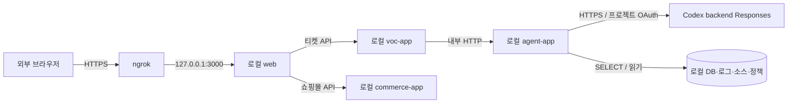

# ngrok로 로컬 데모 연결하기

데모 구성은 **로컬 web + Spring Boot 세 앱 + PostgreSQL + ngrok + Codex OAuth**다.
ngrok는 외부 브라우저를 로컬 web에 연결한다. 조사·도구 실행·근거 저장은 로컬 Agent에서,
모델 추론은 Codex OAuth backend에서 수행한다. 프로모션 API 크레딧은 배포에만 사용한다. [실행 계약](llm-runtime.md)을 따른다.

이 문서는 구현·시연 절차다. Agent의 [OAuth/API 분리 설정](llm-runtime.md)은 구현됐지만 실제 모델 품질은 미검증이다. web·공개 URL·외부 데모 검증은 남아 있다.

최신 사용자 설정 방침: 로컬 Agent는 `CODEX_AUTH_FILE`로 프로젝트 전용 OAuth를 읽고 API key를 사용하지 않는다.
ngrok 설정과 공개 웹 접속 허용 계정은 별도 로컬 YAML에서 관리하며 사용자가 추후 추가한다.
아래 `runtime/ngrok.yml`·`runtime/ngrok-policy.yml`은 무시되는 경로의 예시다. 실제 경로·계정·정책을
지금 확정하거나 설정 파일을 생성한 상태가 아니며, 이 입력이 준비된 뒤 공개 연결을 검증한다.

## 연결 구성



web은 호스트에서 실행하고 세 앱·DB는 기존 Compose로 실행하는 것을 기본으로 한다.
브라우저는 web의 같은 출처 API만 사용한다. web은 계약에 있는 고정 경로·메서드만 중계하며 임의 URL 프록시를 만들지 않는다.

| 설정·접속 | 값과 위치 |
| --- | --- |
| web 수신 주소 | `127.0.0.1:3000` — 구현할 web의 기본 시연 포트 |
| `VOC_API_BASE_URL` | web 서버 전용 `http://127.0.0.1:8082` — 실제 `VOC_PORT`에 맞춤 |
| `COMMERCE_API_BASE_URL` | web 서버 전용 `http://127.0.0.1:8080` — 실제 `COMMERCE_PORT`에 맞춤 |
| `AGENT_BASE_URL` | VOC 컨테이너의 기존 `http://agent:8080` |
| `COMMERCE_BASE_URL` | VOC 컨테이너의 기존 `http://commerce:8080` |
| 로컬 AI 인증 | Agent 전용 CODEX_AUTH_FILE·CODEX_MODEL. OPENAI_API_KEY는 배포 전용 |
| ngrok 설정 YAML | 예: `runtime/ngrok.yml`. 사용자 추후 추가, OpenAI 키와 별개 |
| 공개 웹 허용 계정·접근 정책 YAML | 예: `runtime/ngrok-policy.yml`. 사용자 추후 추가, 실제 계정은 미정 |
| 공개 HTTPS URL | ngrok가 실제 표시한 주소를 사용. 문서의 예시를 실제 URL로 기록하지 않음 |

web을 추후 컨테이너화하면 web의 백엔드 주소는 Compose 서비스 이름으로 변경한다.
컨테이너의 `127.0.0.1`은 해당 컨테이너 자신이므로 호스트 기본 주소를 그대로 복사하지 않는다.
공개 URL은 내부 서비스 주소나 모델 endpoint에 넣지 않는다. DB·Agent·VOC·commerce 포트에 별도 터널을 만들지 않는다.

## 준비와 실행

1. 기존 [로컬 개발 절차](local-development.md)로 Java 21·Docker·DB·세 앱을 준비한다.
2. 김아름의 web 구현에서 티켓·분석·근거와 쇼핑몰 API 중계, 화면·API 접근 제어를 연결한다.
   `web/package.json`의 `build`·`start`를 준비하고 `start`가 Next.js 실행 옵션을 전달하도록 한다.
3. ngrok CLI와 계정 authtoken을 [공식 설치·시작 안내](https://ngrok.com/docs/start)에 따라 로컬 설정 YAML에 준비한다.
   토큰 값을 Git·공유 로그·명령 예시에 저장하지 않는다. 선택한 ngrok 요금제의 제한은 별도로 확인한다.
4. 시연 참가자에게만 허용하는 계정·접근 정책을 별도 로컬 YAML에 준비한다(예: `runtime/ngrok-policy.yml`).
   [OAuth Traffic Policy](https://ngrok.com/docs/gateway/traffic-policy/actions/oauth) 등을 사용하고 로그인 허용 대상도 제한한다.
   이 경로는 Git에서 제외된 runtime 아래이며, 정책 파일은 현재 저장소에 생성되어 있지 않다.
5. web 구현·접근 제어·내부 연결을 먼저 검증한 뒤 아래 명령으로 시연한다. 일반 up/check/publish는 터널을 자동으로 열지 않는다.

```bash
# 저장소 루트: 기존 백엔드 실행·연결 확인
./scripts/dev up
./scripts/dev smoke

# web 구현 및 위 서버 전용 환경 설정을 마친 후
npm --prefix web ci
npm --prefix web run build
npm --prefix web run start -- --hostname 127.0.0.1 --port 3000
```

별도 터미널에서, authtoken과 접근 정책이 준비됐을 때 web 한 곳만 연결한다.

```bash
ngrok config check --config runtime/ngrok.yml
ngrok http http://127.0.0.1:3000 --config runtime/ngrok.yml --inspect=false --traffic-policy-file runtime/ngrok-policy.yml
```

ngrok CLI의 `http`, `--traffic-policy-file`, `--inspect`는 [공식 CLI 안내](https://ngrok.com/docs/gateway/agent/cli)를 따른다.
`--inspect=false`는 로컬 HTTP 검사 기능 설정이며 클라우드의 모든 로그 보관을 끈다는 뜻은 아니다.
위 web·정책 준비가 끝나기 전에는 이 명령을 실행 가능한 데모가 완성됐다는 근거로 사용하지 않는다.

## 로컬 OAuth 사용

[최초 로그인·실행 설명](llm-runtime.md)대로 `./scripts/llm login` 후 local/codex_oauth와 모델을 지정한다.
영상 촬영은 `./scripts/llm demo`로 같은 로컬 OAuth 경로를 사용한다. 프로모션 API 크레딧은 배포 환경에서만 사용하며
OAuth 제한/실패 시 API key로 전환하지 않는다. ngrok authtoken과 OAuth 파일은 별개이며 사용량/요금 조건을 각각 확인한다.

## 연결 확인과 종료

- 먼저 모의 모델로 공개 URL의 화면·인증·티켓 API·polling·근거 조회 경로를 확인한다. 인증되지 않은 화면/API 접근은 거절되어야 한다.
- 실제 모델 검증은 승인된 데모 조건에서 티켓 → 조사 → 실제 도구·근거 → 보고서 → 근거 원문까지 확인한다. 모의 결과와 구분한다.
- 공개 경로에서 `/internal/*`·`/actuator/*`와 임의 내부 API를 중계하지 않는지 확인한다. 키·서버 설정을 브라우저 번들에 넣지 않는다.
- 터널을 끊어도 실행 중 조사는 로컬 Agent에서 계속된다. 재연결·새로고침 시 저장된 조사 ID로 조회하고 조회만으로 LLM을 다시 호출하지 않는다.
- 공개 URL·접근 정책·검증 커밋/buildId·실제/모의 모델·성공/실패를 구분해 자기 상태 문서에 남긴다. URL 재접속과 실제 AI 조사를 별도 확인한다.
- 데모 종료 시 ngrok 터미널에서 `Ctrl+C`로 터널을 닫는다. web도 종료하고 백엔드는 필요할 때 `./scripts/dev down`으로 내린다. DB 볼륨은 유지한다.

web·중계·공개 URL 검증은 김아름, Agent의 모델 설정·조사 지속·근거·비용 제어는 한재홍,
커머스 재현·공유 근거와 최종 통합 검토는 이상효가 담당한다. 실제 결과가 없으면 터널·서비스 AI 완료로 기록하지 않는다.
