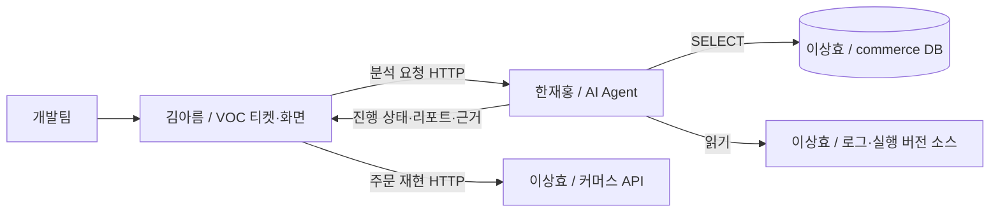

# 담당자별 구현 범위와 먼저 맞출 인터페이스

이 문서는 세 사람이 같은 `main`에서 역할별로 구현하기 위한 시작점이다. 공통 실행 골격은 준비됐으며 아래 업무 API·테이블·AI 기능은 구현 전이다. 각 PC에서는 [자기 역할의 goal](../goals/README.md)을 시작한다. 이름은 담당자를 나타내며 GitHub 계정과 구분한다.

## 1. 각자 만드는 것

| 담당자 | 만드는 것 | 구현 문서 | 주요 소유 경로 |
| --- | --- | --- | --- |
| 이상효 | 7개 문제가 재현되는 이커머스와 조사용 데이터·로그·소스 | [이커머스 구현 범위](lee-sanghyo-commerce.md) | `commerce-app/`, `commerce-core/`, `commerce-infra/`, `fixtures/commerce/` |
| 김아름 | VOC 티켓 관리, AI 분석 연동, 리포트·해결방안 화면 | [VOC·연동 구현 범위](kim-areum-voc.md) | `voc-app/`, `voc-core/`, `voc-infra/`, `web/`, `scenario-runner/` |
| 한재홍 | 소스·로그·DB를 조사해 원인과 해결안을 제시하는 AI Agent | [AI Agent 구현 범위](han-jaehong-agent.md) | `agent-app/`, `agent-core/`, `agent-infra/` |

기존 문서의 역할 기호는 A = 한재홍, B = 이상효, C = 김아름이다.

## 2. 연결되는 인터페이스

| 연결 | 제공자 → 사용자 | 공통 기준 문서 |
| --- | --- | --- |
| 커머스 API | 이상효 → 김아름 | [커머스 API·데이터·로그·소스 계약](../commerce-interface.md) |
| DB 조회·로그·실행 소스 | 이상효 → 한재홍 | [커머스 API·데이터·로그·소스 계약](../commerce-interface.md) |
| 조사 접수·진행·근거·보고서 API | 한재홍 → 김아름 | [VOC·Agent 연동 계약](../integration-contract.md) |
| 티켓·분석 요청·리포트 화면 API | 김아름 → `web` | [VOC·Agent 연동 계약](../integration-contract.md) |

공통 계약 문서에 필드와 상태의 정의를 둔다. 담당 문서는 구현할 기능과 전달 순서를 설명한다. 인터페이스를 바꾸면 제공자와 사용자의 문서를 함께 맞춘다.

## 3. 첫 번째 전달 순서

1. **이상효**: 커머스 DDL·시드, 주문·재고 API, 예제 로그와 소스 스냅샷을 제공한다.
2. **한재홍**: 계약에 맞는 조사 접수·조회 API와 예제 보고서를 먼저 제공하고 실제 조회 도구를 연결한다.
3. **김아름**: 동일한 예제 JSON으로 티켓·상태·리포트 화면을 만들고 실제 Agent API로 연결한다.
4. **세 사람**: 첫날에 VOC-07 한 건을 티켓 등록부터 근거 열람까지 연결하고 나머지 시나리오로 확장한다.

UI나 연동 개발용 예제 응답에는 테스트 데이터임을 표시한다. 실제 모델·DB·로그 조회가 끝나야 해당 기능을 통합 완료로 기록한다.

## 4. 공통 완료 기준

- 티켓에 입력한 문의가 커머스의 실제 코드·로그·데이터 조회로 이어진다.
- 분석 결과는 같은 리포트 형식으로 저장되고 화면에 표시된다.
- 리포트의 근거를 열면 해당 레코드·로그·소스 위치를 확인할 수 있다.
- 같은 요청의 재전송은 같은 조사로 연결되고, 추가 정보를 넣은 재조사는 별도 이력으로 남는다.
- 분석 완료와 티켓 해결을 구분하며, 업무 데이터 수정은 사람이 수행할 조치로 제안한다.
- 7개 장애와 정상·정보 부족 사례의 실제 실행 결과를 기록한다.

공통 빌드·Compose·CI는 김아름이 초안을 취합하고 이상효·한재홍이 각 앱의 실행 설정을 제공한다. 각자 독립 clone의 `main`에서 작업하고 [협업 가이드](../collaboration.md)에 따라 동기화한다.
